# MySQL数据库深入

> data:2018.11.03


## MySQL架构介绍

### MySQL简介

MySQL是一个关系型数据库管理系统，由瑞典MySQL AB公司开发，目前属于Oracle公司。

MySQL是一种关联数据库管理系统(RDBMS)，将数据保存在不同的表中，而不是将所有数据放在一个大仓库内，这样就增加了速度并提高了灵活性。

MySQL是开源的，所以你不需要支付额外的费用。

MySQL支持大型的数据库。可以处理拥有上千万条记录的大型数据库。

MySQL使用标准的SQL数据语言形式。

MySQL可以允许于多个系统上，并且支持多种语言。这些编程语言包括C、C++、Python、Java、Perl、PHP、Eiffel、Ruby和Tcl等。

MySQL支持大型数据库，支持5000万条记录的数据仓库，32位系统表文件最大可支持4GB，64位系统支持最大的表文件为8TB。

MySQL是可以定制的，采用了GPL协议，你可以修改源码来开发自己的MySQL系统。


**MySQL的优势：**
借阿里的去Oracle化来说明：
1、开源免费，很多有能力的公司都会自己维护MySQL代码。

2、体积小、速度快、可移植、支持多种操作系统。MySQL的核心程序采用完全的多线程编程。

3、很好的适应互联网大规模应用对扩展性的要求。与其说是去IOE，更不如说是分布式架构战胜了集中式架构。

4、Oracle主要是依赖中高档存储设备和小型机，MySQL可以采用PC Server+伪分布式的模式。Oracle+中高档存储设备和小型机的模式，无法满足业务增长的需求。

**MySQL的缺点：**
1、最大的缺点是安全性，会出现小概率数据丢失的问题。

金融系统要求在主库故障的时候不能丢失任何数据，MySQL无法做到这一点。

2、不支持热备份。

**高级MySQL涉及到知识：**

+ MySQL内核
+ sql优化
+ MySQL服务器的优化
+ 各种参数常量设定
+ 查询语句优化
+ 主从复制
+ 软硬件升级
+ 容灾备份
+ sql编程等等。


### MySQL 操作

**MySQL服务的相关操作**：


查看MySQL安装时创建的MySQL用户和MySQL组：
```
cat /etc/passwd | grep MySQL
cat /etc/group | grep MySQL
```
MySQL服务的启动和停止：
查看MySQL启停状态: ` ps -ef | grep MySQL`

**服务启动和停止操作:**

```
/etc/init.d/MySQL start
/etc/init.d/MySQL stop
```
或者
```
service MySQL start
service MySQL stop
```


**设置MySQL启动密码**（默认安装没有密码，直接输入`MySQL`启动）：
`/usr/bin/MySQLadmin -u root password admin`
再次启动：`MySQL -uroot -p admin`


**设置MySQL自启服务：**
设置自动启动：`chkconfig MySQL on`
检查是否设置了自动启动：`chkconfig --list | grep MySQL`

`ntsysv`查看kai开机自启的程序


**在linux下查看安装目录**：
`ps -ef|grep MySQL`

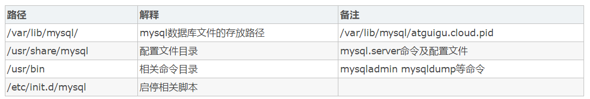

**修改配置文件位置:**
`cp /usr/share/MySQL/my-huge.cnf /etc/my.cnf`或者`cp /usr/share/MySQL/my-default.cnf /etc/my.cnf`


**MySQL配置文件查找优先级：**

/etc/my.cnf 	/etc/MySQL/my.cnf 	/usr/etc/my.cnf 	~/.my.cnf


**修改字符集和数据存储路径:**
查看字符集:
show variables like 'character%';
show variables like '%char%';

默认的是客户端和服务器都用了latin1，所以会乱码。

修改字符集，修改之前copy 的配置文件。
vim /etc/my.cnf

```properties
[client]
#password = your_password
port = 3306
socket = /var/lib/MySQL/MySQL.sock

# 这一行需要设置字符集
default-character-set=utf8
 
# The MySQL server
[MySQLd]
port = 3306

# 还有这三行
character_set_server=utf8
character_set_client=utf8
collation-server=utf8_general_ci

socket = /var/lib/MySQL/MySQL.sock
skip-external-locking
key_buffer_size = 384M
max_allowed_packet = 1M
table_open_cache = 512
sort_buffer_size = 2M
read_buffer_size = 2M
read_rnd_buffer_size = 8M
myisam_sort_buffer_size = 64M
thread_cache_size = 8
query_cache_size = 32M
# Try number of CPU's*2 for thread_concurrency
thread_concurrency = 8
 
[MySQL]
no-auto-rehash
# 还有这一行
default-character-set=utf8
```


### MySQL配置文件

**二进制日志log-bin**：
主要用于主从复制

```properties
# Replication Master Server (default)
# binary logging is required for replication
log-bin=#主从复制文件的位置
```

**错误日志log-error**:
默认是关闭的,记录严重的警告和错误信息，每次启动和关闭的详细信息等。

```properties
log-err=#错误日志文件的位置
```

**查询日志log**:
默认关闭，记录查询的sql语句，如果开启会减低MySQL的整体性能，因为记录日志也是需要消耗系统资源的.

**数据文件:**

+ 数据库
    + windows
      D:\devSoft\MySQLServer5.5\data目录下
    + Linux:
      默认路径 cd /var/lib/MySQL/
      看看当前系统中的全部库后再进去 ls -1F | grep 
+ frm文件: 存放表结构
+ myd文件: 存放表数据
+ myi文件: 存放表索引


**如何配置：**
Windows: my.ini文件
Linux: /etc/my.cnf文件

### MySQL架构

我们来先看官网的一张图：


我们来介绍一下各个部分：
**Connectors**：不同语言中与SQL的交互。

**Connection Pool**：管理缓冲用户连接，线程处理等需要缓存的需求。
负责监听对MySQL Server的各种请求，转发所有连接请求到线程管理模块。每一个连接上MySQL Server的客户端请求都会被分配（或创建）一个连接线程为其单独服务。而连接线程的主要工作就是负责 MySQL Server与客户端的通信，接受客户端的命令请求，传递Server端的结果信息等。

**Management Serveices & Utilities**：系统管理和控制工具。

**SQL Interface**：接受用户的SQL命令，并且返回用户需要查询的结果。

**Parser**：验证和解析SQL命令。

将SQL语句进行语义和语法的分析，分解成数据结构，然后按照不同的操作类型进行分类，然后做出针对性的转发到后续步骤，以后SQL语句的传递和处理就是基于这个结构的。
如果在分解构成中遇到错误，那么就说明这个sql语句是不合理的。

**Optimizer**：SQL语句在查询之前会使用查询优化器对查询进行优化。就是优化客户端请求的 query（sql语句） ，根据客户端请求的 query 语句，和数据库中的一些统计信息，在一系列算法的基础上进行分析，得出一个最优的策略，告诉后面的程序如何取得这个 query 语句的结果。

**Cache & Buffer**：主要功能是将客户端提交给MySQL的Select类查询请求的返回结果集缓存到内存中，与该 query 的一个hash值做一个对应。该查询所取数据的基表发生任何数据的变化之后，MySQL会自动使该查询的Cache失效。在读写比例非常高的应用系统中，Query Cache对性能的提高是非常显著的。当然它对内存的消耗也是非常大的。

 **Storage Engines**：存储引擎真正的负责了MySQL中数据的存储和提取，服务器通过API与存储引擎进行通信。
注意，存储引擎时基于表的，不是基于数据库的。

和其它数据库相比，MySQL有点与众不同，它的架构可以在多种不同场景中应用并发挥良好作用。主要体现在存储引擎的架构上，**插件式的存储引擎架构将查询处理和其它的系统任务以及数据的存储提取相分离。**这种架构可以根据业务的需求和实际需要选择合适的存储引擎。


我们以分层的思想简单介绍一下各个层：
**1、连接层**
最上层是一些客户端和连接服务，包含本地sock通信和大多数基于客户端/服务端工具实现的类似于tcp/ip的通信。主要完成一些类似于连接处理、授权认证、及相关的安全方案。在该层上引入了线程池的概念，为通过认证安全接入的客户端提供线程。同样在该层上可以实现基于SSL的安全链接。服务器也会为安全接入的每个客户端验证它所具有的操作权限。

**2、服务层**
第二层架构主要完成大多少的核心服务功能，如SQL接口，并完成缓存的查询，SQL的分析和优化及部分内置函数的执行。所有跨存储引擎的功能也在这一层实现，如过程、函数等。在该层，服务器会解析查询并创建相应的内部解析树，并对其完成相应的优化如确定查询表的顺序，是否利用索引等，最后生成相应的执行操作。如果是select语句，服务器还会查询内部的缓存。如果缓存空间足够大，这样在解决大量读操作的环境中能够很好的提升系统的性能。

**3、引擎层**
存储引擎层，存储引擎真正的负责了MySQL中数据的存储和提取，服务器通过API与存储引擎进行通信。不同的存储引擎具有的功能不同，这样我们可以根据自己的实际需要进行选取。后面介绍MyISAM和InnoDB

**4、存储层**
数据存储层，主要是将数据存储在运行于裸设备的文件系统之上，并完成与存储引擎的交互。

**查询说明：**
MySQL的查询流程大致是：
1.MySQL客户端通过协议与MySQL服务器建连接，发送查询语句，先检查查询缓存，如果命中，直接返回结果，否则进行语句解析。
2.有一系列预处理，比如检查语句是否写正确了，然后是查询优化（比如是否使用索引扫描，如果是一个不可能的条件，则提前终止），生成查询计划，然后查询引擎启动，开始执行查询，从底层存储引擎调用API获取数据，最后返回给客户端。怎么存数据、怎么取数据，都与存储引擎有关。
3.MySQL默认使用的BTREE索引，并且一个大方向是，无论怎么折腾sql，至少在目前来说，MySQL最多只用到表中的一个索引。

### MySQL存储引擎

#### MySQL存储引擎查看
查看MySQL存储引擎命令
查看当前的MySQL 提供什么存储引擎

```
MySQL> show engines;
```

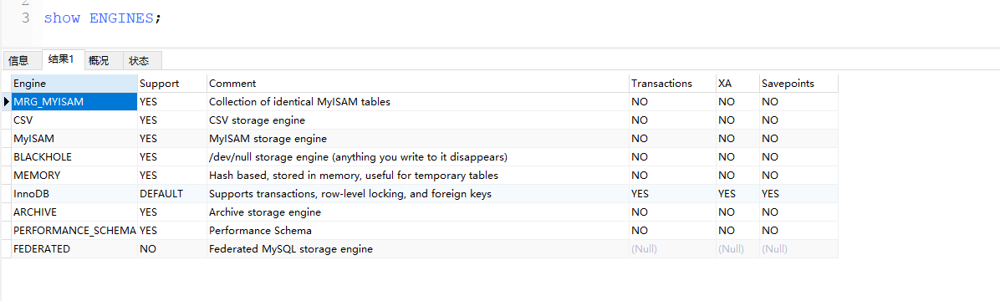

看你的 MySQL 当前默认的存储引擎:
```
show variables like '%storage_engine%';
```

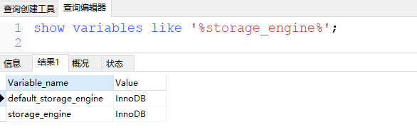


目前主流的MySQL存储引擎有：MyISAM和InnoDB。

####  MyISAM
曾经是MySQL的默认存储引擎。
优势在于**占用空间小，处理速度快**。缺点是**不支持事务的完整性和并发性**。

1、不支持事务和行级锁。所以只能对整张表加锁而不是对行，不适用写操作比较多的场景。
2、不支持外键。
3、提供大量特性如全文索引、空间函数、压缩、延迟更新等。
4、数据库故障后，安全恢复性差。
5、不支持单表一个文件，会将所有的数据和索引内容分别存在两个文件中。
6、支持索引缓存不支持数据缓存。
7、支持3种不同的存储格式：静态(固定长度)表、动态表、压缩表。
静态表：优点是存储非常迅速，容易缓存，出现故障容易恢复。缺点是占用的空间通常比动态表多。
动态表：优点是占用空间较少。缺点是频繁更新删除记录会产生碎片。
压缩表：由myisamchk工具创建，占据非常小的空间，每条记录都是被单独压缩。


#### InnoDB
InnoDB给MySQL的表提供了**事务处理、回滚、崩溃修复能力和多版本并发控制的事务安全**。
这种存储引擎已经被很多互联网公司使用，为用户操作非常大的数据存储提供了一个强大的解决方案。
MySQL 5.6版本中，作为默认存储引擎。
1、将数据存储在表空间中，表空间由一系列的数据文件组成，由InnoDB管理。
2、支持每个表的数据和索引存放在单独文件中(innodb_file_per_table)。
3、支持事务，采用MVCC来控制并发，并实现标准的4个事务隔离级别，支持外键。
4、索引基于聚簇索引建立，对于主键查询有较高性能。
5、数据文件的平台无关性，支持数据在不同的架构平台移植。
6、能够通过一些工具支持真正的热备。如XtraBackup等。
7、内部进行自身优化。如采取可预测性预读，能够自动在内存中创建hash索引等。


#### MyISAM和InnoDB对比

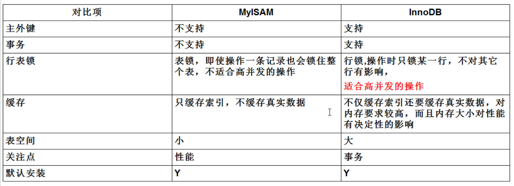

阿里巴巴通过Percona为MySQL数据库服务器进行了改进，在功能和性能上较MySQL有着很显著的提升。该版本提升了在高负载情况下的InnoDB的性能、为DBA提供一些非常有用的性能诊断工具；另外有更多的参数和命令来控制服务器行为。
该公司新建了一款存储引擎叫xtradb完全可以替代innodb,并且在性能和并发上做得更好,
阿里巴巴大部分MySQL数据库其实使用的percona的原型加以修改。


## MySQL索引优化分析

### MySQL性能下降的原因

MySQL性能下降主要有：SQL慢、执行时间长、等待时间长

1.查询语句写的烂 

2.索引失效（索引分为单值索引和复合索引）

+ 单值索引创建： create index idx_user_name on user(name)；
+ 复合索引创建：create index idx_user_nameEmail on user(name,email)；

3.关联查询太多join 

4.服务器调优及参数设置（缓存，线程数等）


### join查询

#### SQL执行顺序

**手写SQL顺序:**

```sql
SELECT DISTINCT
    <select_list>
FROM
     <left_table> <join_type>
JOIN <right_table> ON <join_condition>
WHERE 
    <where_condition>
GROUP BY
    <group_by_list>
HAVING
    <having_condition>
ORDER BY
    <order_by_condition>
LIMIT <limit_number>
```

**机读SQL顺序：**

```sql
FROM
     <left_table>
ON <join_condition>
<join_type> JOIN <right_table> 
WHERE 
    <where_condition>
GROUP BY
    <group_by_list>
HAVING
    <having_condition>
SELECT DISTINCT
    <select_list>
ORDER BY
    <order_by_condition>
LIMIT <limit_number>
```

**总结-SQL解析顺序:**


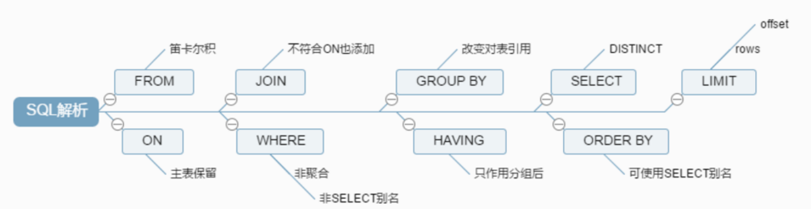

#### 7种join分析

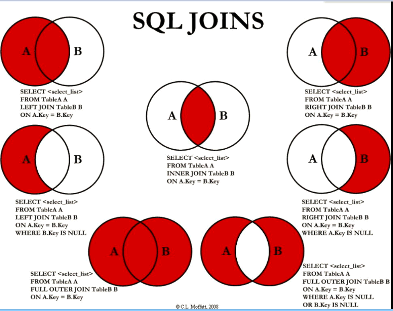

#### join SQL 练习

建表：
```sql
-- 建表和数据SQL
CREATE TABLE `tbl_dept` (
 `id` INT(11) NOT NULL AUTO_INCREMENT,
 `deptName` VARCHAR(30) DEFAULT NULL,
 `locAdd` VARCHAR(40) DEFAULT NULL,
 PRIMARY KEY (`id`)
) ENGINE=INNODB AUTO_INCREMENT=1 DEFAULT CHARSET=utf8;
 
CREATE TABLE `tbl_emp` (
 `id` INT(11) NOT NULL AUTO_INCREMENT,
 `name` VARCHAR(20) DEFAULT NULL,
 `deptId` INT(11) DEFAULT NULL,
 PRIMARY KEY (`id`),
 KEY `fk_dept_id` (`deptId`)
 #CONSTRAINT `fk_dept_id` FOREIGN KEY (`deptId`) REFERENCES `tbl_dept` (`id`)
) ENGINE=INNODB AUTO_INCREMENT=1 DEFAULT CHARSET=utf8;
 
 
--- 插入数据
INSERT INTO tbl_dept(deptName,locAdd) VALUES('RD',11);
INSERT INTO tbl_dept(deptName,locAdd) VALUES('HR',12);
INSERT INTO tbl_dept(deptName,locAdd) VALUES('MK',13);
INSERT INTO tbl_dept(deptName,locAdd) VALUES('MIS',14);
INSERT INTO tbl_dept(deptName,locAdd) VALUES('FD',15);

INSERT INTO tbl_emp(NAME,deptId) VALUES('z3',1);
INSERT INTO tbl_emp(NAME,deptId) VALUES('z4',1);
INSERT INTO tbl_emp(NAME,deptId) VALUES('z5',1);
INSERT INTO tbl_emp(NAME,deptId) VALUES('w5',2);
INSERT INTO tbl_emp(NAME,deptId) VALUES('w6',2);
INSERT INTO tbl_emp(NAME,deptId) VALUES('s7',1);
INSERT INTO tbl_emp(NAME,deptI d) VALUES('s8',2);
INSERT INTO tbl_emp(NAME,deptId) VALUES('s9',51);

```


**练习：**

1、A、B两表共有
`select * from tbl_emp a inner join tbl_dept b on a.deptId = b.id;`

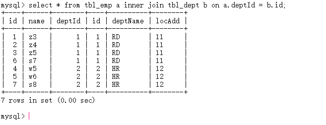

2、A、B两表共有+A的独有
`select * from tbl_emp a left join tbl_dept b on a.deptId = b.id;`

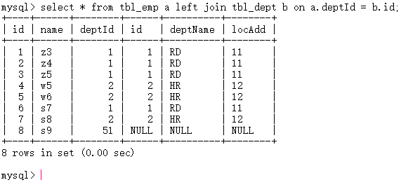

3、A、B两表共有+B的独有
`select * from tbl_emp a right join tbl_dept b on a.deptId = b.id;`

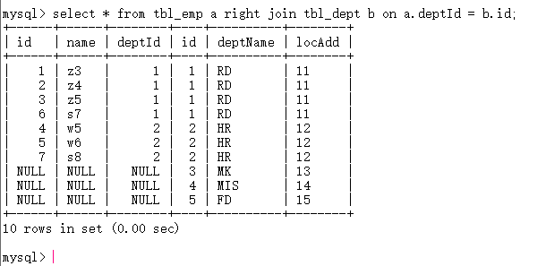

4、A的独有
`select * from tbl_emp a left join tbl_dept b on a.deptId = b.id where b.id is null;`

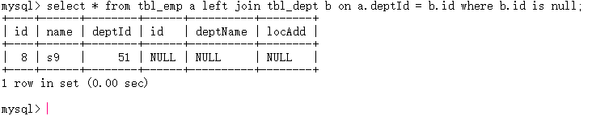

5、B的独有
`select * from tbl_emp a right join tbl_dept b on a.deptId = b.id where a.deptId is null;`

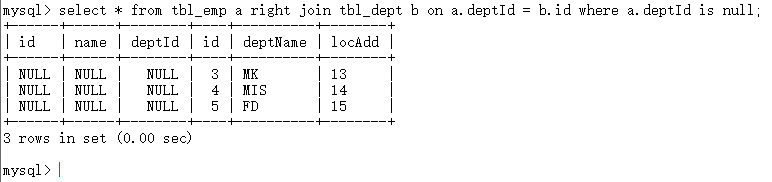

6、AB全有
**MySQL Full Join的实现 因为MySQL不支持FULL JOIN,下面是替代方法
left join + union(可去除重复数据)+ right join**

```
SELECT *
FROM tbl_emp a LEFT JOIN tbl_dept b ON a.deptId = b.id
UNION 
SELECT *
FROM tbl_emp a RIGHT JOIN tbl_dept b ON a.deptId = b.id;
```

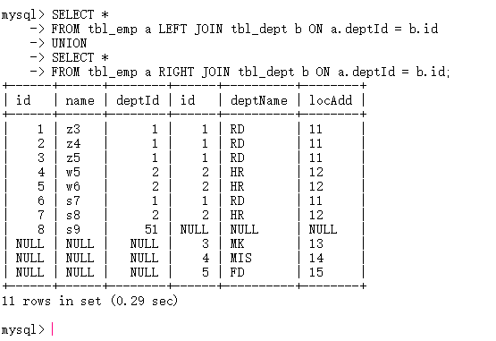

7、A的独有 + B的独有

```
SELECT *
FROM tbl_emp a LEFT JOIN tbl_dept b ON a.deptId = b.id
WHERE b.id IS NULL
UNION
SELECT *
FROM tbl_emp a RIGHT JOIN tbl_dept b ON a.deptId = b.id
WHERE a.`deptId` IS NULL;
```

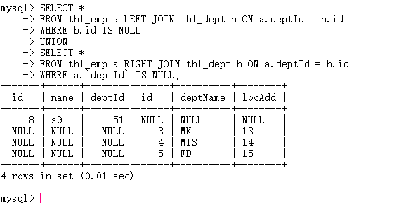

### 索引简介

#### 什么是索引

MySQL官方对索引的定义为：索引（Index）是帮助MySQL高效获取数据的**数据结构**。

可以看出，索引的本质：索引是数据结构。

索引的目的在于提高查询效率，可以类比字典，如果要查“MySQL”这个单词，我们肯定需要定位到m字母，然后从下往下找到y字母，再找到剩下的sql。

如果没有索引，那么你可能需要a----z，如果我想找到Java开头的单词呢？或者Oracle开头的单词呢？

你可以简单理解为“**排好序的快速查找结构**”

在数据之外，数据库系统还维护着满足特定查找算法的数据结构，**这些数据结构以某种方式引用（指向）数据**，这样就可以在这些数据结构上实现高级查找算法。这种数据结构，就是索引。
下图就是一种可能的索引方式示例：

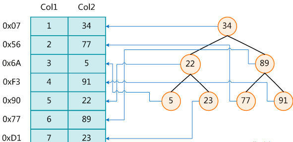

左边是数据表，共有两列七条记录，最左边的是数据记录的物理地址。

为了加快Col2的查找，可以维护一个右边所示的二叉查找树，每个节点分别包含索引键值和一个指向对应数据记录物理地址的指针，这样就可以运用二叉查找在一定的复杂度内获取到相应数据，从而快速的检索出符合条件的记录。

一般来说索引本身也很大，不可能全部存储在内存中，因此索引往往以**索引文件**的形式存储的磁盘上。

我们平常所说的索引，如果没有特别指明，都是指B+树结构组织的索引。其中聚集索引，次要索引，覆盖索引，复合索引，前缀索引，唯一索引默认都是使用B+树索引，统称索引。当然，除了B+树这种类型的索引之外，还有哈希索引(hash index)等。

#### B+ Tree

InnoDB和MyISAM中其实不是用的B-Tree，而是用的B+Tree数据结构来保存索引。
B+Tree意味着所有的值（被索引的列）都是按顺序存储的，每个叶子节点到跟节点距离相等。

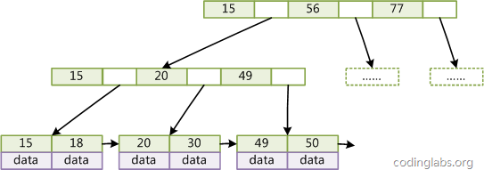

**B+的特性:**
1、所有关键字都出现在叶子结点的链表中，且链表中的关键字是有序的。
2、不可能在非叶子结点命中，非叶子节点不存储数据。
3、非叶子结点相当于是叶子结点的索引，叶子结点相当于是存储（关键字）数据的数据层。
4、更适合文件索引系统。

如上图所示，在B+Tree的每个叶子节点增加一个指向相邻叶子节点的指针，就形成了带有顺序访问指针的B+Tree。做这个优化的目的是为了提高区间访问的性能。例如，要查询key为从18到49的所有数据记录，当找到18后，只需顺着节点和指针顺序遍历就可以一次性访问到所有数据节点，极大提到了区间查询效率。

我们后文会对索引的原理进行深入讲解。

#### 索引的优缺点

**索引的优势：**
1.类似大学图书馆建书目索引，提高数据检索的效率，降低数据库的IO成本。
2.通过索引列对数据进行排序，降低数据排序的成本，降低了CPU的消耗。

**索引的劣势：**
1.实际上索引也是一张表，该表保存了主键与索引字段，并指向实体表的记录，所以索引列也是要占用空间的。
2.虽然索引大大提高了查询速度，同时却会降低更新表的速度，如对表进行INSERT、UPDATE和DELETE。因为更新表时，MySQL不仅要保存数据，还要保存一下索引文件每次更新添加了索引列的字段，都会调整因为更新所带来的键值变化后的索引信息。
3.索引只是提高效率的一个因素，如果你的MySQL有大数据量的表，就需要花时间研究建立最优秀的索引，或优化查询语句。


#### 索引分类

**单值索引**
即一个索引只包含单个列，一个表可以有多个单列索引

**唯一索引**
索引列的值必须唯一，但允许有空值

**复合索引**
即一个索包含多个列

**基本语法：**

**创建索引**
两种方式:
`CREATE [UNIQUE ] INDEX indexName ON mytable(columnname(length));`
如果是CHAR，VARCHAR类型，length 可以小于字段实际长度；
如果是 BLOB 和 TEXT 类型，必须指定 length。
`ALTER mytable ADD [UNIQUE ] INDEX [indexName] ON (columnname(length))`

**删除索引**
`DROP INDEX [indexName] ON mytable;`

**查看索引**
`SHOW INDEX FROM table_name\G`


使用Alter 命令有四种方式来添加数据表的索引：
1.ALTER TABLE tbl_name ADD PRIMARY KEY (column_list)
该语句添加一个主键，这意味着索引值必须是唯一的，且不能为NULL。

2.ALTER TABLE tbl_name ADD UNIQUE index_name (column_list)
这条语句创建索引的值必须是唯一的（除了NULL外，NULL可能会出现多次）。

3.ALTER TABLE tbl_name ADD INDEX index_name (column_list)
添加普通索引，索引值可出现多次。

4.ALTER TABLE tbl_name ADD FULLTEXT index_name (column_list)
该语句指定了索引为 FULLTEXT ，用于全文索引。

#### MySQL索引结构分类
BTree索引
Hash索引
full-text索引
R-Tree 索引

### MySQL索引原理

#### 索引的本质

索引的本质：索引是数据结构。

我们知道，数据库查询是数据库的最主要功能之一。我们都希望查询数据的速度能尽可能的快，因此数据库系统的设计者会从查询算法的角度进行优化。最基本的查询算法当然是**顺序查找**（linear search），这种复杂度为O(n)的算法在数据量很大时显然是糟糕的，好在计算机科学的发展提供了很多更优秀的查找算法，例如**二分查找**（binary search）、**二叉树查找**（binary tree search）等。

如果稍微分析一下会发现，每种查找算法都只能应用于特定的数据结构之上，例如二分查找要求被检索数据有序，而二叉树查找只能应用于二叉查找树上，但是数据本身的组织结构不可能完全满足各种数据结构（例如，理论上不可能同时将两列都按顺序进行组织），所以，在数据之外，数据库系统还维护着满足特定查找算法的数据结构，这些数据结构以某种方式引用（指向）数据，这样就可以在这些数据结构上实现高级查找算法。这种数据结构，就是索引。

#### B-Tree（平衡多路查找树）

B-Tree是为磁盘等外存储设备设计的一种平衡查找树。因此在讲B-Tree之前先了解下磁盘的相关知识。

系统从磁盘读取数据到内存时是以**磁盘块（block）**为基本单位的，位于同一个磁盘块中的数据会被一次性读取出来，而不是需要什么取什么。

InnoDB存储引擎中有页（Page）的概念，页是其磁盘管理的最小单位。InnoDB存储引擎中默认每个页的大小为16KB，可通过参数innodb_page_size将页的大小设置为4K、8K、16K，在MySQL中可通过如下命令查看页的大小：

```
MySQL> show variables like 'innodb_page_size';
```

而系统一个磁盘块的存储空间往往没有这么大，因此InnoDB每次申请磁盘空间时都会是若干地址连续磁盘块来达到页的大小16KB。InnoDB在把磁盘数据读入到磁盘时会以页为基本单位，在查询数据时如果一个页中的每条数据都能有助于定位数据记录的位置，这将会减少磁盘I/O次数，提高查询效率。

B-Tree结构的数据可以让系统高效的找到数据所在的磁盘块。为了描述B-Tree，首先定义一条记录为一个二元组[key,data]，key为记录的键值，对应表中的主键值，data为一行记录中除主键外的数据。对于不同的记录，key值互不相同。

一棵m阶的B-Tree有如下特性： 
1. 每个节点最多有m个孩子。 
2. 除了根节点和叶子节点外，其它每个节点至少有ceil(m/2)个孩子。 
3. 若根节点不是叶子节点，则至少有2个孩子。
4. 所有叶子节点都在同一层，且不包含其它关键字信息。 
5. 每个非终端节点包含n个关键字信息（P0,P1,…Pn, k1,…kn） 
6. 关键字的个数n满足：ceil(m/2)-1 <= n <= m-1 
7. ki(i=1,…n)为关键字，且关键字升序排序。 
8. Pi(i=1,…n)为指向子树根节点的指针。P(i-1)指向的子树的所有节点关键字均小于ki，但都大于k(i-1)。

B-Tree中的每个节点根据实际情况可以包含大量的关键字信息和分支，如下图所示为一个3阶的B-Tree：


每个节点占用一个盘块的磁盘空间，一个节点上有两个升序排序的关键字和三个指向子树根节点的指针，指针存储的是子节点所在磁盘块的地址。两个关键词划分成的三个范围域对应三个指针指向的子树的数据的范围域。以根节点为例，关键字为17和35，P1指针指向的子树的数据范围为小于17，P2指针指向的子树的数据范围为17~35，P3指针指向的子树的数据范围为大于35。

**模拟查找关键字29的过程：**
根据根节点找到磁盘块1，读入内存。【磁盘I/O操作第1次】
比较关键字29在区间（17,35），找到磁盘块1的指针P2。
根据P2指针找到磁盘块3，读入内存。【磁盘I/O操作第2次】
比较关键字29在区间（26,30），找到磁盘块3的指针P2。
根据P2指针找到磁盘块8，读入内存。【磁盘I/O操作第3次】
在磁盘块8中的关键字列表中找到关键字29。

分析上面过程，发现需要**3次磁盘I/O操作，和3次内存查找操作**。由于内存中的关键字是一个有序表结构，可以利用二分法查找提高效率。**而3次磁盘I/O操作是影响整个B-Tree查找效率的决定因素。**B-Tree相对于AVLTree缩减了节点个数，使每次磁盘I/O取到内存的数据都发挥了作用，从而提高了查询效率。

#### B+Tree

B+Tree是在B-Tree基础上的一种优化，使其更适合实现外存储索引结构，InnoDB存储引擎就是用B+Tree实现其索引结构。

从上一节中的B-Tree结构图中可以看到每个节点中不仅包含数据的key值，还有data值。而每一个页的存储空间是有限的，如果data数据较大时将会导致每个节点（即一个页）能存储的key的数量很小，当存储的数据量很大时同样会导致B-Tree的深度较大，增大查询时的磁盘I/O次数，进而影响查询效率。在B+Tree中，所有数据记录节点都是按照键值大小顺序存放在同一层的叶子节点上，而非叶子节点上只存储key值信息，这样可以大大加大每个节点存储的key值数量，降低B+Tree的高度。

B+Tree相对于B-Tree有几点不同：
1.非叶子节点只存储键值信息。
2.所有叶子节点之间都有一个链指针。
3.数据记录都存放在叶子节点中。

将上一节中的B-Tree优化，由于B+Tree的非叶子节点只存储键值信息，假设每个磁盘块能存储4个键值及指针信息，则变成B+Tree后其结构如下图所示：


通常在B+Tree上有两个头指针，一个指向根节点，另一个指向关键字最小的叶子节点，而且所有叶子节点（即数据节点）之间是一种链式环结构。因此可以对B+Tree进行两种查找运算：一种是对于主键的范围查找和分页查找，另一种是从根节点开始，进行随机查找。

#### 为什么使用B+Tree而不使用B-Tree?

B-树和B+树最重要的一个区别就是B+树只有叶节点存放数据，其余节点用来索引，而B-树是每个索引节点都会有Data域。这就决定了B+树更适合用来存储外部数据，也就是所谓的磁盘数据。

从Mysql（Inoodb）的角度来看，B+树是用来充当索引的，一般来说索引非常大，尤其是关系性数据库这种数据量大的索引能达到亿级别，所以为了减少内存的占用，索引也会被存储在磁盘上。

那么Mysql如何衡量查询效率呢？磁盘IO次数，B-树（B类树）的特定就是每层节点数目非常多，层数很少，目的就是为了就少磁盘IO次数，当查询数据的时候，最好的情况就是很快找到目标索引，然后读取数据，使用B+树就能很好的完成这个目的，但是B-树的每个节点都有data域（指针），这无疑增大了节点大小，说白了增加了磁盘IO次数（磁盘IO一次读出的数据量大小是固定的，单个数据变大，每次读出的就少，IO次数增多，一次IO多耗时啊！），而B+树除了叶子节点其它节点并不存储数据，节点小，磁盘IO次数就少。这是优点之一。
另一个优点是什么，B+树所有的Data域在叶子节点，一般来说都会进行一个优化，就是将所有的叶子节点用指针串起来。这样遍历叶子节点就能获得全部数据，这样就能进行区间访问啦。

(数据库索引采用B+树的主要原因是 B树在提高了磁盘IO性能的同时并没有解决元素遍历的效率低下的问题。正是为了解决这个问题，B+树应运而生。B+树只要遍历叶子节点就可以实现整棵树的遍历。而且在数据库中基于范围的查询是非常频繁的（可以看成计算机中经典的局部性原理），而B树不支持这样的操作（或者说效率太低）)


#### 为什么使用B-Tree（B+Tree）

上文说过，红黑树等数据结构也可以用来实现索引，但是文件系统及数据库系统普遍采用B-/+Tree作为索引结构，这一节将结合计算机组成原理相关知识讨论B-/+Tree作为索引的理论基础。

**一般来说，索引本身也很大，不可能全部存储在内存中，因此索引往往以索引文件的形式存储的磁盘上。这样的话，索引查找过程中就要产生磁盘I/O消耗，相对于内存存取，I/O存取的消耗要高几个数量级，所以评价一个数据结构作为索引的优劣最重要的指标就是在查找过程中磁盘I/O操作次数的渐进复杂度。换句话说，索引的结构组织要尽量减少查找过程中磁盘I/O的存取次数。**下面先介绍内存和磁盘存取原理，然后再结合这些原理分析B-/+Tree作为索引的效率。

**主存存取原理**
目前计算机使用的主存基本都是随机读写存储器（RAM），现代RAM的结构和存取原理比较复杂，这里本文抛却具体差别，抽象出一个十分简单的存取模型来说明RAM的工作原理。

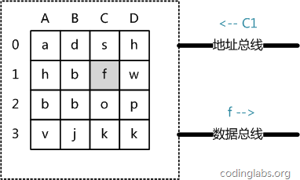

从抽象角度看，主存是一系列的存储单元组成的矩阵，每个存储单元存储固定大小的数据。每个存储单元有唯一的地址，现代主存的编址规则比较复杂，这里将其简化成一个二维地址：通过一个行地址和一个列地址可以唯一定位到一个存储单元。图5展示了一个4 x 4的主存模型。

**主存的存取过程如下：**
 当系统需要读取主存时，则将地址信号放到地址总线上传给主存，主存读到地址信号后，解析信号并定位到指定存储单元，然后将此存储单元数据放到数据总线上，供其它部件读取。

写主存的过程类似，系统将要写入单元地址和数据分别放在地址总线和数据总线上，主存读取两个总线的内容，做相应的写操作。
这里可以看出，主存存取的时间仅与存取次数呈线性关系，因为不存在机械操作，两次存取的数据的“距离”不会对时间有任何影响，例如，先取A0再取A1和先取A0再取D3的时间消耗是一样的。

**磁盘存取原理**


上面说过，索引一般以文件形式存储在磁盘上，索引检索需要磁盘I/O操作。与主存不同，磁盘I/O存在机械运动耗费，因此磁盘I/O的时间消耗是巨大的。

下图是磁盘的整体结构示意图。

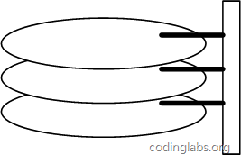

一个磁盘由大小相同且同轴的圆形盘片组成，磁盘可以转动（各个磁盘必须同步转动）。在磁盘的一侧有磁头支架，磁头支架固定了一组磁头，每个磁头负责存取一个磁盘的内容。磁头不能转动，但是可以沿磁盘半径方向运动（实际是斜切向运动），每个磁头同一时刻也必须是同轴的，即从正上方向下看，所有磁头任何时候都是重叠的（不过目前已经有多磁头独立技术，可不受此限制）。

下图是磁盘结构的示意图。

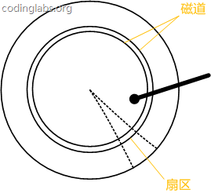

盘片被划分成一系列同心环，圆心是盘片中心，每个同心环叫做一个磁道，所有半径相同的磁道组成一个柱面。磁道被沿半径线划分成一个个小的段，每个段叫做一个扇区，每个扇区是磁盘的最小存储单元。为了简单起见，我们下面假设磁盘只有一个盘片和一个磁头。

当需要从磁盘读取数据时，系统会将数据逻辑地址传给磁盘，磁盘的控制电路按照寻址逻辑将逻辑地址翻译成物理地址，即确定要读的数据在哪个磁道，哪个扇区。为了读取这个扇区的数据，需要将磁头放到这个扇区上方，为了实现这一点，磁头需要移动对准相应磁道，这个过程叫做寻道，所耗费时间叫做寻道时间，然后磁盘旋转将目标扇区旋转到磁头下，这个过程耗费的时间叫做旋转时间。

**局部性原理与磁盘预读**
由于存储介质的特性，磁盘本身存取就比主存慢很多，再加上机械运动耗费，磁盘的存取速度往往是主存的几百分分之一，因此为了提高效率，要尽量减少磁盘I/O。为了达到这个目的，磁盘往往不是严格按需读取，而是每次都会预读，即使只需要一个字节，磁盘也会从这个位置开始，顺序向后读取一定长度的数据放入内存。这样做的理论依据是计算机科学中著名的局部性原理：

当一个数据被用到时，其附近的数据也通常会马上被使用。

程序运行期间所需要的数据通常比较集中。

由于磁盘顺序读取的效率很高（不需要寻道时间，只需很少的旋转时间），因此对于具有局部性的程序来说，预读可以提高I/O效率。

预读的长度一般为页（page）的整倍数。页是计算机管理存储器的逻辑块，硬件及操作系统往往将主存和磁盘存储区分割为连续的大小相等的块，每个存储块称为一页（在许多操作系统中，页得大小通常为4k），主存和磁盘以页为单位交换数据。当程序要读取的数据不在主存中时，会触发一个缺页异常，此时系统会向磁盘发出读盘信号，磁盘会找到数据的起始位置并向后连续读取一页或几页载入内存中，然后异常返回，程序继续运行。

#### B-/+Tree索引的性能分析

**上文说过一般使用磁盘I/O次数评价索引结构的优劣。先从B-Tree分析，根据B-Tree的定义，可知检索一次最多需要访问h个节点。数据库系统的设计者巧妙利用了磁盘预读原理，将一个节点的大小设为等于一个页，这样每个节点只需要一次I/O就可以完全载入。**为了达到这个目的，在实际实现B-Tree还需要使用如下技巧：

每次新建节点时，直接申请一个页的空间，这样就保证一个节点物理上也存储在一个页里，加之计算机存储分配都是按页对齐的，就实现了一个node只需一次I/O。

B-Tree中一次检索最多需要h-1次I/O（根节点常驻内存），渐进复杂度为O(h)=O(logdN)O(h)=O(logdN)。一般实际应用中，出度d是非常大的数字，通常超过100，因此h非常小（通常不超过3）。

综上所述，用B-Tree作为索引结构效率是非常高的。

而红黑树这种结构，h明显要深的多。由于逻辑上很近的节点（父子）物理上可能很远，无法利用局部性，所以红黑树的I/O渐进复杂度也为O(h)，效率明显比B-Tree差很多。
上文还说过，B+Tree更适合外存索引，原因和内节点出度d有关。从上面分析可以看到，d越大索引的性能越好，而出度的上限取决于节点内key和data的大小：
dmax=floor(pagesize/(keysize+datasize+pointsize))dmax=floor(pagesize/(keysize+datasize+pointsize))

floor表示向下取整。由于B+Tree内节点去掉了data域，因此可以拥有更大的出度，拥有更好的性能。

#### 聚簇索引与非聚簇索引
MySQL中普遍使用B+Tree做索引，但在实现上又根据聚簇索引和非聚簇索引而不同。

**1、聚簇索引**

**所谓聚簇索引，就是指主索引文件和数据文件为同一份文件，聚簇索引主要用在Innodb存储引擎中。在该索引实现方式中B+Tree的叶子节点上的data就是数据本身，key为主键，如果是一般索引的话，data便会指向对应的主索引**，如下图所示：


在B+Tree的每个叶子节点增加一个指向相邻叶子节点的指针，就形成了带有顺序访问指针的B+Tree。做这个优化的目的是为了提高区间访问的性能，例如上图中如果要查询key为从18到49的所有数据记录，当找到18后，只需顺着节点和指针顺序遍历就可以一次性访问到所有数据节点，极大提到了区间查询效率。

**2、非聚簇索引**

**非聚簇索引就是指B+Tree的叶子节点上的data，并不是数据本身，而是数据存放的地址。主索引和辅助索引没啥区别，只是主索引中的key一定得是唯一的。主要用在MyISAM存储引擎中**，如下图：

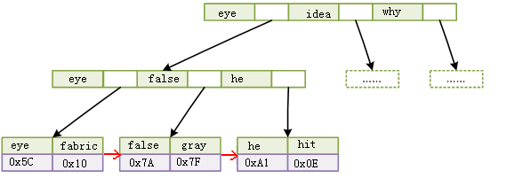

非聚簇索引比聚簇索引多了一次读取数据的IO操作，所以查找性能上会差。

#### MySQL索引实现

在MySQL中，索引属于存储引擎级别的概念，不同存储引擎对索引的实现方式是不同的，下面主要讨论MyISAM和InnoDB两个存储引擎的索引实现方式。

**1、MyISAM索引实现**

MyISAM引擎使用B+Tree作为索引结构，叶节点的data域存放的是数据记录的地址。下图是MyISAM索引的原理图：


这里设表一共有三列，假设我们以Col1为主键，则上图是一个MyISAM表的主索引（Primary key）示意。可以看出MyISAM的索引文件仅仅保存数据记录的地址。在MyISAM中，主索引和辅助索引（Secondary key）在结构上没有任何区别，只是主索引要求key是唯一的，而辅助索引的key可以重复。如果我们在Col2上建立一个辅助索引，则此索引的结构如下图所示：


同样也是一颗B+Tree，data域保存数据记录的地址。因此，MyISAM中索引检索的算法为首先按照B+Tree搜索算法搜索索引，如果指定的Key存在，则取出其data域的值，然后以data域的值为地址，读取相应数据记录。

MyISAM的索引方式也叫做“非聚集”的，之所以这么称呼是为了与InnoDB的聚集索引区分。

**2、InnoDB索引实现**

虽然InnoDB也使用B+Tree作为索引结构，但具体实现方式却与MyISAM截然不同。

第一个重大区别是InnoDB的数据文件本身就是索引文件。从上文知道，MyISAM索引文件和数据文件是分离的，索引文件仅保存数据记录的地址。而在InnoDB中，表数据文件本身就是按B+Tree组织的一个索引结构，这棵树的叶节点data域保存了完整的数据记录。这个索引的key是数据表的主键，因此InnoDB表数据文件本身就是主索引。


上图是InnoDB主索引（同时也是数据文件）的示意图，可以看到叶节点包含了完整的数据记录。这种索引叫做聚集索引。因为InnoDB的数据文件本身要按主键聚集，所以InnoDB要求表必须有主键（MyISAM可以没有），如果没有显式指定，则MySQL系统会自动选择一个可以唯一标识数据记录的列作为主键，如果不存在这种列，则MySQL自动为InnoDB表生成一个隐含字段作为主键，这个字段长度为6个字节，类型为长整形。

第二个与MyISAM索引的不同是InnoDB的辅助索引data域存储相应记录主键的值而不是地址。换句话说，InnoDB的所有辅助索引都引用主键作为data域。例如，下图为定义在Col3上的一个辅助索引：


这里以英文字符的ASCII码作为比较准则。聚集索引这种实现方式使得按主键的搜索十分高效，但是辅助索引搜索需要检索两遍索引：**首先检索辅助索引获得主键，然后用主键到主索引中检索获得记录。**

了解不同存储引擎的索引实现方式对于正确使用和优化索引都非常有帮助，例如知道了InnoDB的索引实现后，就很容易明白为什么**不建议使用过长的字段作为主键**，因为所有辅助索引都引用主索引，过长的主索引会令辅助索引变得过大。再例如，用非单调的字段作为主键在InnoDB中不是个好主意，因为InnoDB数据文件本身是一颗B+Tree，非单调的主键会造成在插入新记录时数据文件为了维持B+Tree的特性而频繁的分裂调整，十分低效，**而使用自增字段作为主键则是一个很好的选择。**

对于InnoDB而言，因为节点下有数据文件，因此节点的分裂将会比较慢。对于InnoDB的主键，尽量用整型，而且是递增的整型。如果是无规律的数据，将会产生页的分裂，影响速度。


**InnoDB索引和MyISAM索引的区别：**

一是主索引的区别，InnoDB的数据文件本身就是索引文件。而MyISAM的索引和数据是分开的。

二是辅助索引的区别：InnoDB的辅助索引data域存储相应记录主键的值而不是地址。而MyISAM的辅助索引和主索引没有多大区别。

InnoDB的主索引文件上，直接存放该行数据，称为聚簇索引。次索引指向对主键的引用。
Myisam中，主索引和次索引都指向物理行。

补充：索引覆盖
索引覆盖是指如果查询的列恰好是索引的一部分，那么查询只需要在索引文件上进行，不需要回行到磁盘再找数据。这种查询速度非常快，称为“索引覆盖”。

### 索引使用场景

**适合建索引的场景**
a.主键自动建立唯一索引
b.频繁作为查询条件的字段应该创建索引
c.查询中与其它表关联的字段，外键关系建立索引
d.频繁更新的字段不适合建立索引（因为每次更新不仅仅是更新数据还要更新索引，加重io负担）
e.where条件里用不到的字段不创建索引
f.单键/组合索引的选择问题（在高并发下倾向创建组合索引）
g.查询中排序的字段，排序字段若通过索引去访问将大大提高排序速度
h.查询中统计或分组的字段

**不适合建索引的场景**
a.表记录太少
b.经常增删改查的表（读少写多）
c.数据重复且分布平均的表字段，因此应该只为最经常查询和最经常排序的数据列建立索引，注意，如果某个数据列包含许多重复内容，为它建立索引就没有太大的实际效果

### 性能分析

#### MySQL Query Optimizer

MySQL内部有自己的优化器，当收到sql时，会按它自己认为最好的优化方式去优化。

专门负责优化SELECT语句的优化器模块MySQL Query Optimizer通过计算分析收集的各种系统统计信息，为Query给出最优的执行计划——最优的数据检索方式。

客户端向MySQL发送Query请求，命令解析器模块完成请求分类，把SELECT Query转发给MySQL Query Optimizer，MySQL Query Optimizer首先会对整条Query进行优化，进行常量表达式的预算，直接换算成常量值。并对Query中的查询条件进行简化和转换，如去掉一些无用或显而易见的条件、结构调整等。然后分析Query中的Hint信息（如果有），看Hint信息是否可以完全确定该Query的执行计划。如果没有Hint或Hint信息还不足以完全确定执行计划，则会读取所涉及对象的统计信息，根据Query进行相应的计算分析，最后得出执行计划。


#### MySQL常见瓶颈

CPU：CPU在饱和的时候一般发生在数据装入内存或从磁盘上读取数据的时候

IO：磁盘I/O瓶颈发生在装入数据远大于内存容量时(IO频繁)

服务器的性能瓶颈：top，free，iostat和vmstat来查看系统的性能状态

#### Explain

**Explain是什么？**
查看执行计划。使用Explain可以模拟优化器执行SQl查询语句，从而知道MySQL是如何处理你的sql语句的，从而分析是否存在性能结构。

**Explain能干什么？**
a.表的读取顺序
b.数据读取操作的操作类型
c.哪些索引可以使用
d.哪些索引被实际使用
e.表之间的引用
f.每张表有多少行被优化器查询

**Explain怎么用？**

Explain+SQL语句

例如：explain select * from tbl_emp;

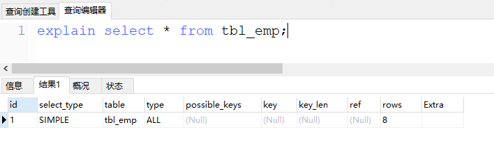


我们通过实验来解释一下上面图的各个字段：
实验准备：
**1.创建测试表**

```sql
CREATE TABLE people(
    id bigint auto_increment primary key,
    zipcode char(32) not null default '',
    address varchar(128) not null default '',
    lastname char(64) not null default '',
    firstname char(64) not null default '',
    birthdate char(10) not null default ''
);

CREATE TABLE people_car(
    people_id bigint,
    plate_number varchar(16) not null default '',
    engine_number varchar(16) not null default '',
    lasttime timestamp
);
```

**2.插入测试数据**
```sql
insert into people
(zipcode,address,lastname,firstname,birthdate)
values
('230031','anhui','zhan','jindong','1989-09-15'),
('100000','beijing','zhang','san','1987-03-11'),
('200000','shanghai','wang','wu','1988-08-25');

insert into people_car
(people_id,plate_number,engine_number,lasttime)
values
(1,'A121311','12121313','2013-11-23 :21:12:21'),
(2,'B121311','1S121313','2011-11-23 :21:12:21'),
(3,'C121311','1211SAS1','2012-11-23 :21:12:21');
```

**3.创建索引用来测试**

```sql
alter table people add key(zipcode,firstname,lastname);
```

**①.id**：select查询的序列号，包含一组数字，表示查询中执行select子句或操作表的顺序，三种情况：
1.id相同，执行顺序由上往下
`EXPLAIN SELECT * FROM people,people_car;`

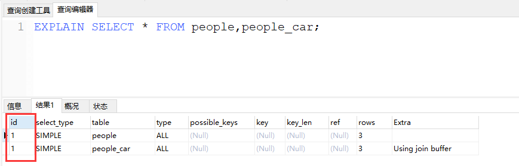

2.id不同，如果是子查询，id序号会递增，**id值越大优先级越高，越先被执行**
`explain select zipcode from (select * from people a) b;`

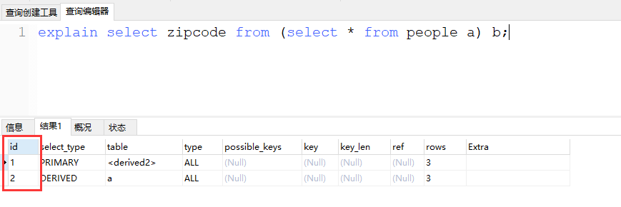

3.id相同不同，同时存在（id如果相同，可以认为是一组，从上往下执行；在所有组中，id越大，优先级越高，越先执行）
`explain select zipcode from (select * from people a) b,people_car c;`

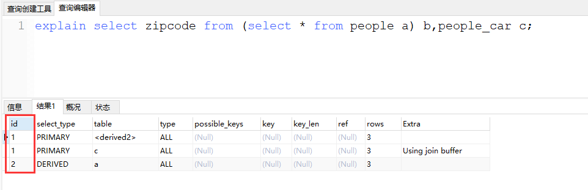

DERIVED表示衍生表。

4.该值可能为NULL，如果这一行用来说明的是其他行的联合结果，比如下面的语句：
`explain select * from people where zipcode = 100000 union select * from people where zipcode = 200000;`

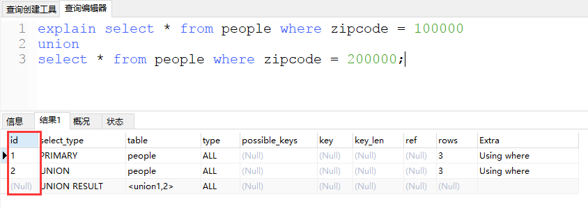

**②.select_type**：主要包含下面几种类型：
1.SIMPLE:简单的select查询，查询中**不包含子查询或者UNION**
`explain select zipcode,firstname,lastname from people;`

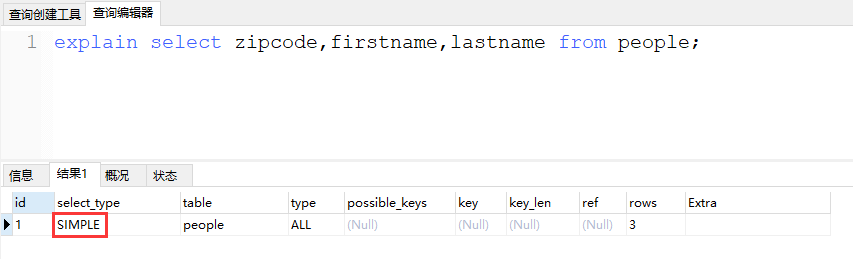

2.PRIMARY:查询中若包含任何复杂的子部分，最外层查询则被标记为PRIMARY（最后加载的表）
`explain select zipcode from (select * from people a) b;`

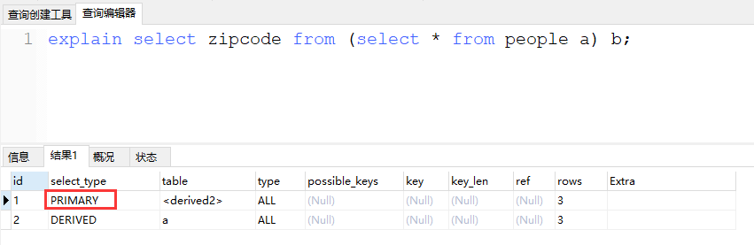

3.SUBQUERY:在SELECT或WHERE列表中包含子查询
`explain select * from people  where id =  (select id from people where zipcode = 100000);`

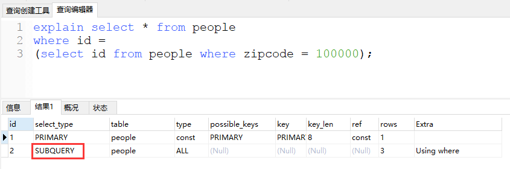

4.DERIVED:在FROM列表中包含的子查询被标记为DERIVED(衍生)，MYSQL会递归查询执行这些子查询，把结果放在**临时表**中。
`explain select zipcode from (select * from people a) b;`

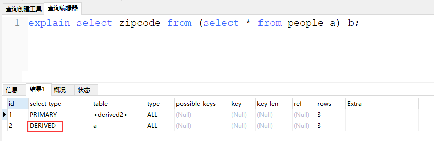

5.UNION:若第二个SELECT出现在UNION之后，被标记为UNION，若UNION包含在FROM子句的子查询中，外层SELECT将被标记为：DERIVED

`explain select * from people where zipcode = 100000 union select * from people where zipcode = 200000;`

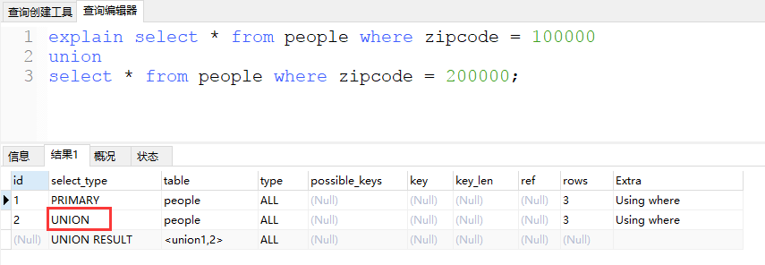

6.UNION RESULT: 从UNION表获取结果的SELECT

`explain select * from people where zipcode = 100000 union select * from people where zipcode = 200000;`

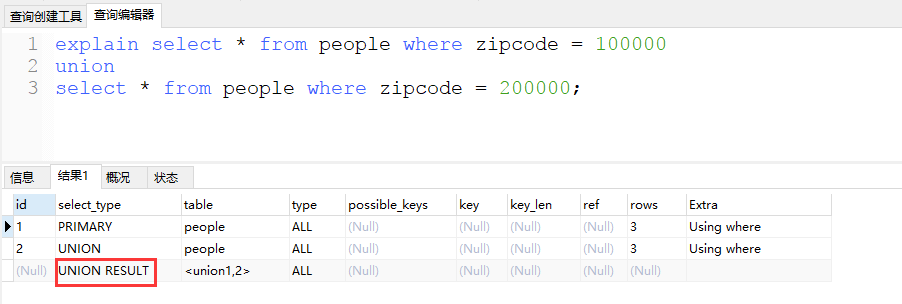

7.DEPENDENT UNION：顾名思义，首先需要满足UNION的条件，及UNION中第二个以及后面的SELECT语句，同时该语句依赖外部的查询。
`explain select * from people where id in  (select id from people where zipcode = 100000 union select id from people where zipcode = 200000 );`

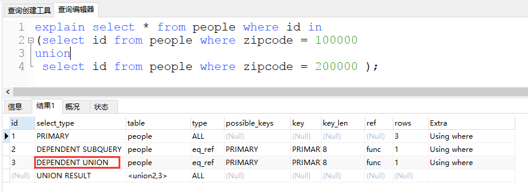

8.DEPENDENT SUBQUERY:和DEPENDENT UNION相对UNION一样。
`explain select * from people o where exists  (select id from people where zipcode = 100000 and id = o.id union select id from people where zipcode = 200000  and id = o.id);`

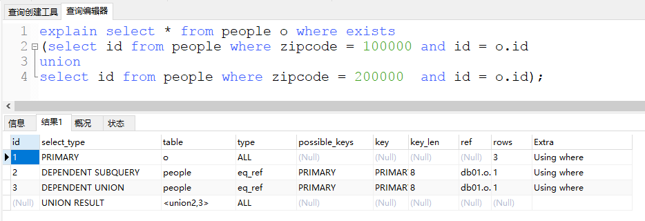

**③.table**：显示的这一行信息是关于哪一张表的。有时候并不是真正的表名。

`explain select * from (select * from (select * from people a) b ) c;`

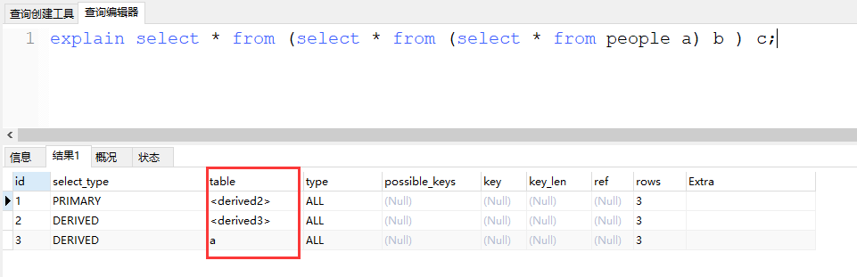

可以看到如果指定了别名就显示的别名。

`<derivedN>` N就是id值，指该id值对应的那一步操作的结果。

还有`<unionM,N>`这种类型，出现在UNION语句中。

注意：MySQL对待这些表和普通表一样，但是这些“临时表”是没有任何索引的。
**④.type**

主要取值有以下几种:ALL、index、range、ref、eq_ref、const、system、 null 

type显示的是访问类型，是较为重要的指标，**结果值从最好到最坏依次是**：

system>const>eq_ref>ref>`fulltext>ref_or_null>index_merge>unique_subquery>index_subquery`>range>index>ALL。

工作中常见的有：
system>const>eq_ref>ref>rang>index>all

一般来说，得保证查询至少达到range级别，最好能达到ref。

下面对这几种进行讲解：
1.system:这是const连接类型的一种特例，表仅有一行,满足条件。
`explain select * from (select * from people where id = 1 )b;`

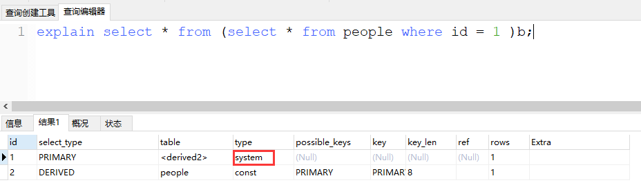

2.const:当确定最多只会有一行匹配的时候，MySQL优化器会在查询前读取它而且只读取一次，因此非常快。const只会用在将常量和主键或唯一索引进行比较时，而且是比较所有的索引字段。people表在id上有一个主键索引，在(zipcode,firstname,lastname)有一个二级索引。

主键索引（满足）：`explain select * from people where id=1;`

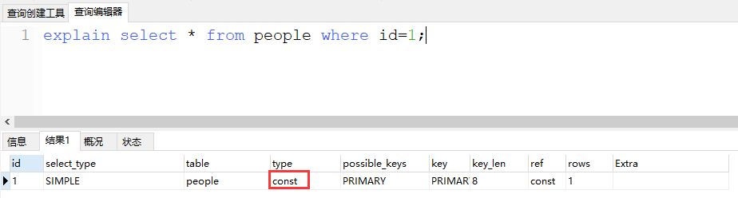

复合索引（不满足）：`explain select * from people where zipcode = 100000 and firstname = 'san' and lastname = 'zhang';`

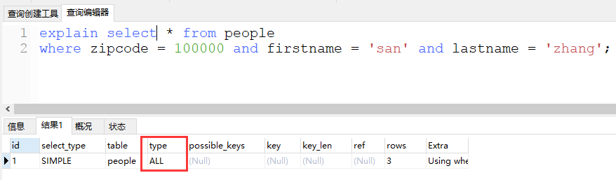

注意下面的也不是const table，虽然也是主键，也只会返回一条结果。

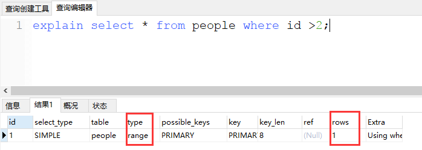

3.eq_ref:唯一性索引扫描。对于每个索引建。表中只有一条记录与之匹配。常见于主键或者唯一索引扫描。

eq_ref类型是除了const外最好的连接类型，它用在一个索引的所有部分被联接使用并且索引是UNIQUE或PRIMARY KEY。
需要注意InnoDB和MyISAM引擎在这一点上有点差别。InnoDB当数据量比较小的情况type会是All。我们上面创建的people和people_car默认都是InnoDB表。

`explain select * from people a,people_car b where a.id = b.people_id;`

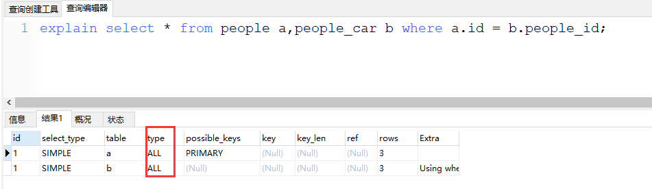

如上图所示，出现的都是ALL，这是因为我们使用的InnoDB引擎造成的，如果MyISAM引擎，则会出现eq_ref。

我们创建两个MyISAM表people2和people_car2试试：
```sql
CREATE TABLE people2(
    id bigint auto_increment primary key,
    zipcode char(32) not null default '',
    address varchar(128) not null default '',
    lastname char(64) not null default '',
    firstname char(64) not null default '',
    birthdate char(10) not null default ''
)ENGINE = MyISAM;

CREATE TABLE people_car2(
    people_id bigint,
    plate_number varchar(16) not null default '',
    engine_number varchar(16) not null default '',
    lasttime timestamp
)ENGINE = MyISAM;
```

插入数据：
```sql
insert into people2
(zipcode,address,lastname,firstname,birthdate)
values
('230031','anhui','zhan','jindong','1989-09-15'),
('100000','beijing','zhang','san','1987-03-11'),
('200000','shanghai','wang','wu','1988-08-25');

insert into people_car2
(people_id,plate_number,engine_number,lasttime)
values
(1,'A121311','12121313','2013-11-23 :21:12:21'),
(2,'B121311','1S121313','2011-11-23 :21:12:21'),
(3,'C121311','1211SAS1','2012-11-23 :21:12:21');
```

`explain select * from people2 a,people_car2 b where a.id = b.people_id;`

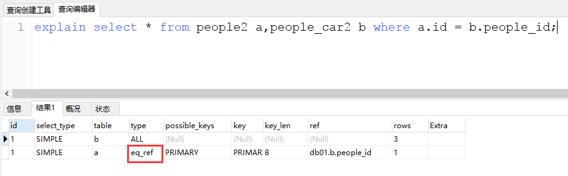

我想这是InnoDB对性能权衡的一个结果。

eq_ref可以用于使用 = 操作符比较的带索引的列。比较值可以为常量或一个使用在该表前面所读取的表的列的表达式。如果关联所用的索引刚好又是主键，那么就会变成更优的const了：
`explain select * from people2 a,people_car2 b where a.id = b.people_id and b.people_id = 1;`

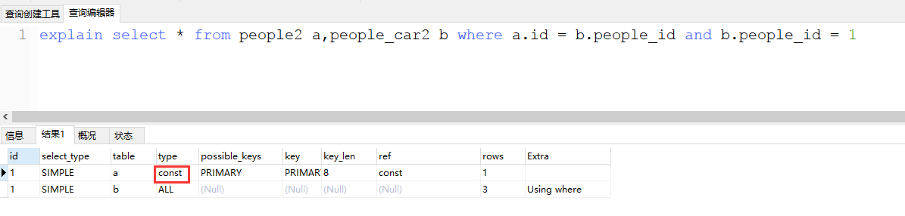


4.ref:这个类型跟eq_ref不同的是，它用在关联操作只使用了索引的最左前缀，或者索引不是UNIQUE和PRIMARY KEY。ref可以用于使用=或<=>操作符的带索引的列。

为了说明我们重新建立上面的people2和people_car2表，仍然使用MyISAM但是不给id指定primary key。然后我们分别给id和people_id建立非唯一索引。

```sql
create index people_id on people2(id);
create index people_id on people_car2(people_id);
```

然后执行：`explain select * from people2 a,people_car2 b where a.id = b.people_id and a.id > 2;`

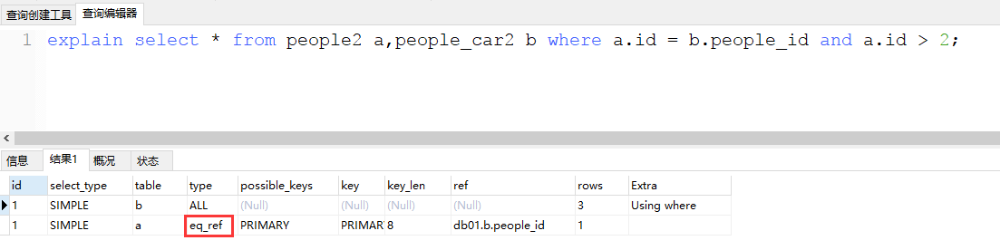

5.range:只检索给定范围的行，使用一个索引来选择行。key列显示使用了哪个索引。key_len包含所使用索引的最长关键元素。在该类型中ref列为NULL。当使用=、<>、>、>=、<、<=、IS NULL、<=>、BETWEEN或者IN操作符，用常量比较关键字列时，可以使用range:
`explain select * from people where id > 2;`

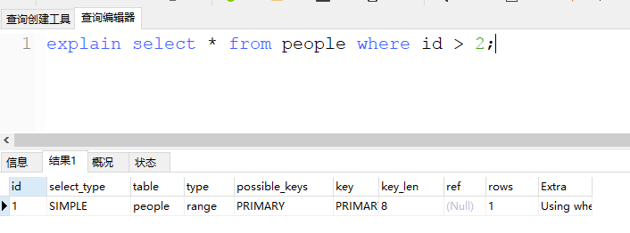

6.index:该联接类型与ALL相同，除了只有索引树被扫描。这通常比ALL快，因为索引文件通常比数据文件小。这个类型通常的作用是告诉我们查询是否使用索引进行排序操作。
`explain select id from people;`

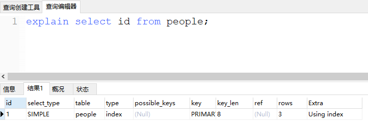

7.ALL:最慢的一种方式，即全表扫描。

**⑤.possible_keys**:显示可能应用在这张表中的索引，一个或多个。查询涉及到的字段上若存在索引，则该索引将被列出，**但不一定被查询实际使用.**

**⑥.key**：实际 使用的索引。如果为NULL，则没有使用索引。
查询中若使用了**覆盖索引**（查询的字段和建立的索引个数和顺序一致），则该索引仅出现在key列表中

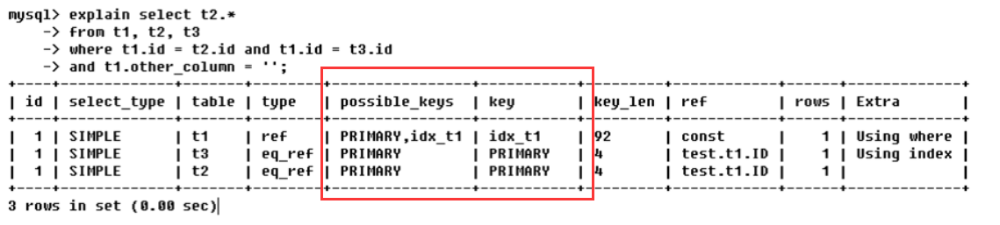

**⑦.key_len**：表示索引中使用的字节数，可通过该列计算查询中使用的索引的长度。在不损失精确性的情况下，长度越短越好。
key_len显示的值为索引字段的最大可能长度，**并非实际使用长度**，即key_len是根据表定义计算而得，不是通过表内检索出的。

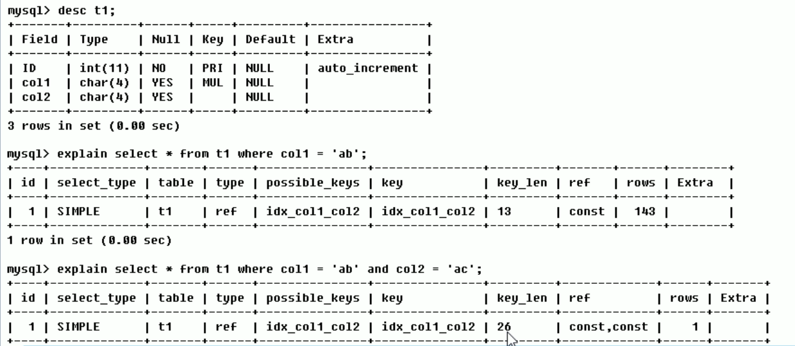


**⑧.ref**：显示索引的哪一列被使用了，如果可能的话，是一个常数。哪些列或常量被用于查找索引列上的值

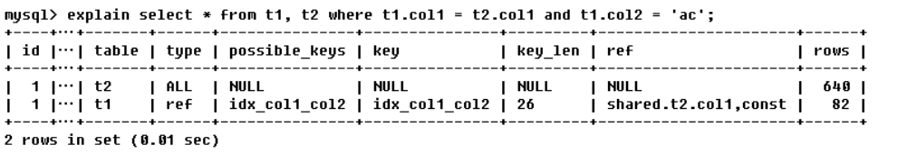

**⑨.rows**：根据表统计信息及索引选用情况，大致估算出找到所需的记录所需要读取的行数


**⑩.Extra**：包含不适合在其他列中显示但十分重要的额外信息
1.using  ：这个说明MySQL会对数据使用一个外部的索引排序，而不是按照表内的索引顺序进行读取。
MySQL有两种方式可以生成有序的结果，通过排序操作或者使用索引，当Extra中出现了Using filesort说明MySQL使用了后者，但注意虽然叫filesort但并不是说明就是用了文件来进行排序，只要可能排序都是在内存里完成的。大部分情况下**利用索引排序更快**，所以一般这时也要考虑优化查询了。

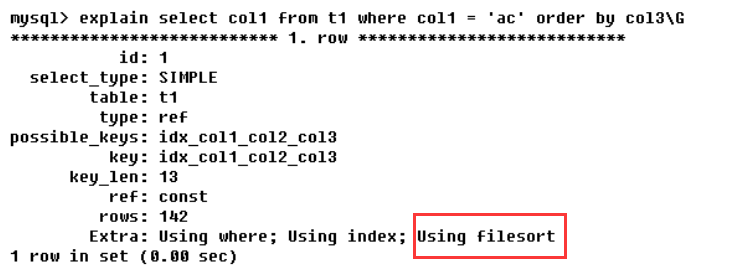

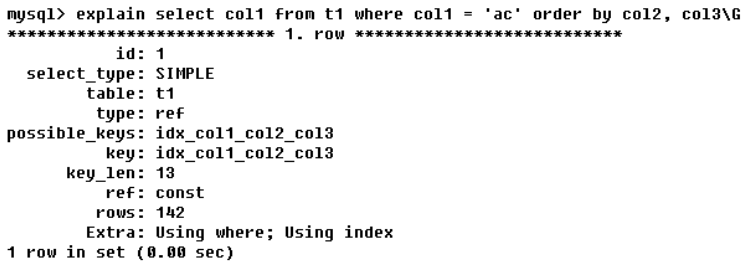


后者速度比较快。

2.Using temporary：说明使用了临时表，一般看到它说明查询**需要优化**了，就算避免不了临时表的使用也要尽量避免硬盘临时表的使用。如果查询包含不同列的GROUP BY和ORDER BY子句，则通常会发生这种情况。

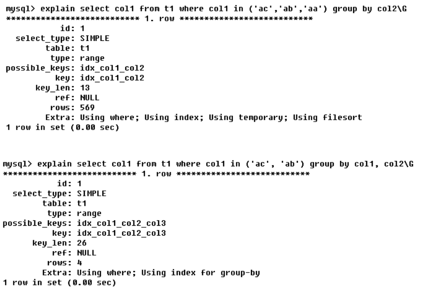

3.Using index ：说明查询是覆盖了索引的，这是好事情。MySQL直接从索引中过滤不需要的记录并返回命中的结果。这是MySQL服务层完成的，但无需再回表查询记录。

如果同时出现using where, 表明索引被用来执行索引键值的查找

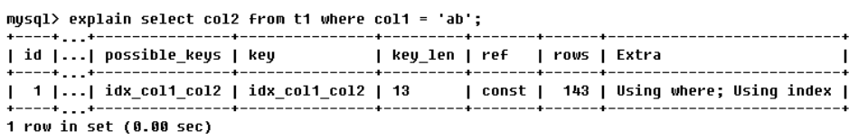


如果没有同时出现using where,表明索引用来读取数据而非执行查找动作。

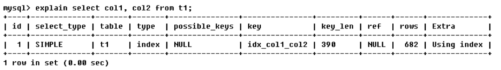

我们来看一下覆盖索引：如果索引包含所有满足查询需要的数据的索引成为覆盖索引(Covering Index)，也就是平时所说的不需要回表操作，使用explain，可以通过输出的extra列来判断，对于一个索引覆盖查询，显示为using index,MySQL查询优化器在执行查询前会决定是否有索引覆盖查询

覆盖索引是一种非常强大的工具，能大大提高查询性能，只需要读取索引而不用读取数据有以下一些优点
1、索引项通常比记录要小，所以MySQL访问更少的数据
2、索引都按值的大小顺序存储，相对于随机访问记录，需要更少的I/O
3、大多数据引擎能更好的缓存索引，比如MyISAM只缓存索引
4、覆盖索引对于InnoDB表尤其有用，因为InnoDB使用聚集索引组织数据，如果二级索引中包含查询所需的数据，就不再需要在聚集索引中查找了

4.Using where：使用了WHERE从句来限制哪些行将与下一张表匹配或者是返回给用户。
注意：Extra列出现Using where表示MySQL服务器将存储引擎返回服务层以后再应用WHERE条件过滤。

5.Using join buffer：使用了连接缓存： 

+ Using join buffer (Block Nested Loop)：
  Block Nested-Loop Join算法：将外层循环的行/结果集存入join buffer, 内层循环的每一行与整个buffer中的记录做比较，从而减少内层循环的次数。优化器管理参数optimizer_switch中中的block_nested_loop参数控制着BNL是否被用于优化器。默认条件下是开启，若果设置为off，优化器在选择 join方式的时候会选择NLJ(Nested Loop Join)算法。
+ Using join buffer (Batched Key Access) 
  Batched Key Access原理：对于多表join语句，当MySQL使用索引访问第二个join表的时候，使用一个join buffer来收集第一个操作对象生成的相关列值。BKA构建好key后，批量传给引擎层做索引查找。key是通过MRR接口提交给引擎的（mrr目的是较为顺序）MRR使得查询更有效率，要使用BKA，必须调整系统参数optimizer_switch的值，batched_key_access设置为on，因为BKA使用了MRR，因此也要打开MRR 

6.impossible where：where子句的值总是false，不能用来获取任何元组

7.select tables optimized away：在没有GROUP BY子句的情况下，基于索引优化MIN/MAX操作，或者对于MyISAM存储引擎优化COUNT(*)操作，不必等到执行阶段再进行计算，查询执行计划生成的阶段即完成优化。

8.distinct：优化distinct操作，在找到第一匹配的元组后即停止找同样值的动作

最后，再看一个查询计划的例子：

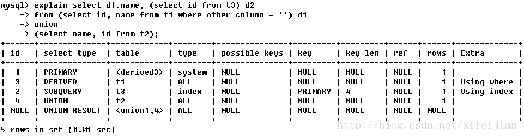


第一行：id列为1，表示第一个select，select_type列的primary表示该查询为外层查询，table列被标记为<derived3>，表示查询结果来自一个衍生表，其中3代表该查询衍生自第三个select查询，即id为3的select。[select d1.name......]

第二行：id为3，表示该查询的执行次序为2（4→3），是整个查询中第三个select的一部分。因查询包含在from中，所以为derived。[select id,name from t1 where other_column='']

第三行：select列表中的子查询，select_type为subquery，为整个查询中的第二个select。[select id from t3]

第四行：select_type为union，说明第四个select是union里的第二个select，最先执行。[select name,id from t2]

第五行：代表从union的临时表中读取行的阶段，table列的<union1,4>表示用第一个和第四个select的结果进行union操作。[两个结果union操作]

 