# Redis基础知识（三）


## Redis集群

### Redis集群简介


Redis 集群是一个提供在多个Redis间节点间共享数据的程序集。

Redis集群并不支持处理多个keys的命令,因为这需要在不同的节点间移动数据,从而达不到像Redis那样的性能,在高负载的情况下可能会导致不可预料的错误.

Redis 集群通过分区来提供一定程度的可用性,在实际环境中当某个节点宕机或者不可达的情况下继续处理命令. Redis 集群的优势:
+ 自动分割数据到不同的节点上。
+ 整个集群的部分节点失败或者不可达的情况下能够继续处理命令。


Redis支持集群最小的单位为6个实例，3个主节点，3个从节点

由于节点比较多，本人电脑资源有限，所以采取在一台虚拟机（虚拟机系统为centos）上部署6个Redis节点，从而实现Redis集群，具体拓扑如下图所示：

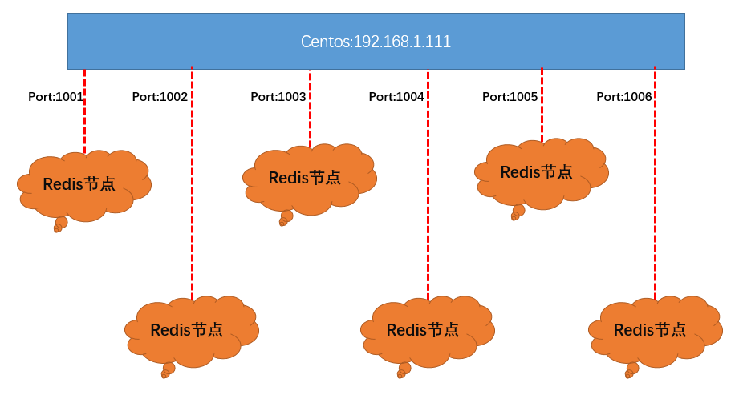

### Redis集群搭建


第一步：在local下创建redis-cluster,然后在其下分别创建6个文件夹：

```
[root@zln111 local]# mkdir -p /usr/local/redis-cluster
[root@zln111 local]# cd /usr/local/redis-cluster
[root@zln111 redis-cluster]# mkdir 1001
[root@zln111 redis-cluster]# mkdir 1002
[root@zln111 redis-cluster]# mkdir 1003
[root@zln111 redis-cluster]# mkdir 1004
[root@zln111 redis-cluster]# mkdir 1005
[root@zln111 redis-cluster]# mkdir 1006
```

第二步：把之前的redis.conf配置分别copy到100*下，进行修改各个文件内容，也就是对100*下的每一个copy的redis.conf文件进行修改，如下：

1．daemonize yes   使用后台服务启动
2．port 100* (分别对每个机器的端口号进行设置，如果是不同的机器则可以不用修改端口)
3．bind 192.168.1.111(必须要绑定当前机器的IP，本机地址为192.168.1.111)
4．dir /usr/local/redis-cluster/100*/ (指定数据文件存放位置，必须要指定不同的目录，不然文件会丢失)
5．cluster-enabled yes  (表示启动集群模式)
6．cluster-config-file nodes-100*conf(这一步主要是为了让各个节点知道其他节点的存在)
7．cluster-node-timeout 5000 (设置访问超时时间5s)
8．appendonly yes  (启用AOP持久化机制)


上面的操作又用到了redis.conf,下面，我们来详细解释一下这个配置文件的各个部分：
```sh
# Redis 配置文件

# 当配置中需要配置内存大小时，可以使用 1k, 5GB, 4M 等类似的格式，其转换方式如下(不区分大小写)
#
# 1k =>1000 bytes
# 1kb => 1024 bytes
# 1m => 1000000 bytes
# 1mb =>1024*1024 bytes
# 1g => 1000000000 bytes
# 1gb => 1024*1024*1024bytes
#
# 内存配置大小写是一样的.比如 1gb 1Gb 1GB 1gB

# daemonize no 默认情况下，redis不是在后台运行的，如果需要在后台运行，把该项的值更改为yes
daemonize yes

# 当redis在后台运行的时候，Redis默认会把pid文件放在/var/run/redis.pid，你可以配置到其他地址。
# 当运行多个redis服务时，需要指定不同的pid文件和端口
pidfile /var/run/redis.pid

# 指定redis运行的端口，默认是6379
port 6379

# 指定redis只接收来自于该IP地址的请求，如果不进行设置，那么将处理所有请求，
# 在生产环境中最好设置该项
# bind 127.0.0.1

# Specify the path for the unix socket that will be used to listen for
# incoming connections. There is no default, so Redis will not listen
# on a unix socket when not specified.
#
# unixsocket /tmp/redis.sock
#
unixsocketperm 755

# 设置客户端连接时的超时时间，单位为秒。当客户端在这段时间内没有发出任何指令，那么关闭该连接
# 0是关闭此设置
timeout 0

# 指定日志记录级别
# Redis总共支持四个级别：debug、verbose、notice、warning，默认为verbose
# debug  记录很多信息，用于开发和测试
# varbose 有用的信息，不像debug会记录那么多
# notice 普通的verbose，常用于生产环境
# warning 只有非常重要或者严重的信息会记录到日志
loglevel debug

# 配置log文件地址
# 默认值为stdout，标准输出，若后台模式会输出到/dev/null
# logfile stdout
logfile /var/log/redis/redis.log

# To enable logging to the system logger, just set 'syslog-enabled' toyes,
# and optionally update the other syslog parameters to suit your needs.
# syslog-enabled no

# Specify the syslog identity.
# syslog-ident redis

# Specify the syslog facility.  Must be USER or between LOCAL0-LOCAL7.
#
syslog-facility local0

# 可用数据库数
# 默认值为16，默认数据库为0，数据库范围在0-（database-1）之间 

databases 16

################################ 快照  #################################
#
# 保存数据到磁盘，格式如下:
#
#   save <seconds> <changes>
#
#   指出在多长时间内，有多少次更新操作，就将数据同步到数据文件rdb。
#   相当于条件触发抓取快照，这个可以多个条件配合
#   
#   比如默认配置文件中的设置，就设置了三个条件
#
#   save 900 1  900秒内至少有1个key被改变
#   save 300 10  300秒内至少有300个key被改变
#   save 60 10000  60秒内至少有10000个key被改变

save 900 1
save 300 10
save 60 10000

# 存储至本地数据库时（持久化到rdb文件）是否压缩数据，默认为yes
rdbcompression yes

# 本地持久化数据库文件名，默认值为dump.rdb
dbfilename dump.rdb

# 工作目录
#
# 数据库镜像备份的文件放置的路径。
# 这里的路径跟文件名要分开配置是因为redis在进行备份时，先会将当前数据库的状态写入到一个临时文件中，等备份完成时，
# 再把该该临时文件替换为上面所指定的文件，而这里的临时文件和上面所配置的备份文件都会放在这个指定的路径当中。
#
# AOF文件也会存放在这个目录下面
#
# 注意这里必须制定一个目录而不是文件
dir ./

################################# 复制 #################################

# 主从复制. 设置该数据库为其他数据库的从数据库.
# 设置当本机为slav服务时，设置master服务的IP地址及端口，在Redis启动时，它会自动从master进行数据同步
#
# slaveof <masterip> <masterport>

# 当master服务设置了密码保护时(用requirepass制定的密码)
# slav服务连接master的密码
#
# masterauth <master-password>


# 当从库同主机失去连接或者复制正在进行，从机库有两种运行方式：
#
# 1)如果slave-serve-stale-data设置为yes(默认设置)，从库会继续相应客户端的请求
#
# 2)如果slave-serve-stale-data是指为no，出去INFO和SLAVOF命令之外的任何请求都会返回一个
#    错误"SYNC with master in progress"
# slave-serve-stale-data yes

# 从库会按照一个时间间隔向主库发送PINGs.可以通过repl-ping-slave-period设置这个时间间隔，默认是10秒
#
# repl-ping-slave-period 10

# repl-timeout 设置主库批量数据传输时间或者ping回复时间间隔，默认值是60秒
# 一定要确保repl-timeout大于repl-ping-slave-period
# repl-timeout 60

################################## 安全 ###################################

# 设置客户端连接后进行任何其他指定前需要使用的密码。
# 警告：因为redis速度相当快，所以在一台比较好的服务器下，一个外部的用户可以在一秒钟进行
# 150K次的密码尝试，这意味着你需要指定非常非常强大的密码来防止暴力破解
#
# requirepass foobared

# 命令重命名.
#
# 在一个共享环境下可以重命名相对危险的命令。比如把CONFIG重名为一个不容易猜测的字符。
#
# 举例:
#
# rename-command CONFIG b840fc02d524045429941cc15f59e41cb7be6c52
#
#如果想删除一个命令，直接把它重命名为一个空字符""即可，如下：
#
# rename-command CONFIG ""

################################### 约束 ####################################

# 设置同一时间最大客户端连接数，默认无限制，Redis可以同时打开的客户端连接数为Redis进程可以打开的最大文件描述符数，
# 如果设置maxclients 0，表示不作限制。
# 当客户端连接数到达限制时，Redis会关闭新的连接并向客户端返回max number of clients reached错误信息
#
# maxclients 128

# 指定Redis最大内存限制，Redis在启动时会把数据加载到内存中，达到最大内存后，Redis会先尝试清除已到期或即将到期的Key
# Redis同时也会移除空的list对象
#
# 当此方法处理后，仍然到达最大内存设置，将无法再进行写入操作，但仍然可以进行读取操作
#
# 注意：Redis新的vm机制，会把Key存放内存，Value会存放在swap区
#
# maxmemory的设置比较适合于把redis当作于类似memcached的缓存来使用，而不适合当做一个真实的DB。
# 当把Redis当做一个真实的数据库使用的时候，内存使用将是一个很大的开销
# maxmemory <bytes>

# 当内存达到最大值的时候Redis会选择删除哪些数据？有五种方式可供选择
#
# volatile-lru ->利用LRU算法移除设置过过期时间的key (LRU:最近使用 Least Recently Used )
# allkeys-lru ->利用LRU算法移除任何key
# volatile-random -> 移除设置过过期时间的随机key
# allkeys->random -> remove a random key, any key
# volatile-ttl -> 移除即将过期的key(minor TTL)
# noeviction -> 不移除任何可以，只是返回一个写错误
#
# 注意：对于上面的策略，如果没有合适的key可以移除，当写的时候Redis会返回一个错误
#
#       写命令包括: set setnx  setex append
#       incr decr rpush lpush rpushx lpushx linsert lset rpoplpush sadd
#       sinter sinterstore sunion sunionstore sdiff sdiffstore zadd zincrby
#       zunionstore zinterstore hset hsetnx hmset hincrby incrby decrby
#       getset mset msetnx exec sort
#
# 默认是:
#
# maxmemory-policy volatile-lru

# LRU 和 minimal TTL 算法都不是精准的算法，但是相对精确的算法(为了节省内存)，随意你可以选择样本大小进行检测。
# Redis默认的灰选择3个样本进行检测，你可以通过maxmemory-samples进行设置
#
# maxmemory-samples 3

############################## AOF ###############################


# 默认情况下，redis会在后台异步的把数据库镜像备份到磁盘，但是该备份是非常耗时的，
# 而且备份也不能很频繁，如果发生诸如拉闸限电、拔插头等状况，那么将造成比较大范围的数据丢失。
# 所以redis提供了另外一种更加高效的数据库备份及灾难恢复方式。
# 开启append only模式之后，redis会把所接收到的每一次写操作请求都追加到appendonly.aof文件中，
# 当redis重新启动时，会从该文件恢复出之前的状态。
# 但是这样会造成appendonly.aof文件过大，所以redis还支持了BGREWRITEAOF指令，对appendonly.aof 进行重新整理。
# 你可以同时开启asynchronous dumps 和 AOF

appendonly no

# AOF文件名称 (默认: "appendonly.aof")
# appendfilename appendonly.aof

# Redis支持三种同步AOF文件的策略:
#
# no: 不进行同步，系统去操作 . Faster.
# always:
always表示每次有写操作都进行同步. Slow, Safest.
# everysec: 表示对写操作进行累积，每秒同步一次.
Compromise.
#
# 默认是"everysec"，按照速度和安全折中这是最好的。
# 如果想让Redis能更高效的运行，你也可以设置为"no"，让操作系统决定什么时候去执行
# 或者相反想让数据更安全你也可以设置为"always"
#
# 如果不确定就用 "everysec".

# appendfsync always
appendfsync everysec
# appendfsync no

# AOF策略设置为always或者everysec时，后台处理进程(后台保存或者AOF日志重写)会执行大量的I/O操作
# 在某些Linux配置中会阻止过长的fsync()请求。注意现在没有任何修复，即使fsync在另外一个线程进行处理
#
# 为了减缓这个问题，可以设置下面这个参数no-appendfsync-on-rewrite
#
# This means that while another child is saving the durability of Redis is
# the same as "appendfsync none", that in pratical terms means that it is
# possible to lost up to 30 seconds of log in the worst scenario (with the
# default Linux settings).
#
# If you have latency problems turn this to "yes". Otherwise eave it as
# "no" that is the safest pick from the point of view of urability.
no-appendfsync-on-rewrite no

# Automatic rewrite of the append only file.
# AOF 自动重写
# 当AOF文件增长到一定大小的时候Redis能够调用 BGREWRITEAOF 对日志文件进行重写
#
# 它是这样工作的：Redis会记住上次进行些日志后文件的大小(如果从开机以来还没进行过重写，那日子大小在开机的时候确定)
#
# 基础大小会同现在的大小进行比较。如果现在的大小比基础大小大制定的百分比，重写功能将启动
# 同时需要指定一个最小大小用于AOF重写，这个用于阻止即使文件很小但是增长幅度很大也去重写AOF文件的情况
# 设置 percentage 为0就关闭这个特性

auto-aof-rewrite-percentage 100
auto-aof-rewrite-min-size 64mb

################################## SLOW LOG ###################################

# Redis Slow Log 记录超过特定执行时间的命令。执行时间不包括I/O计算比如连接客户端，返回结果等，只是命令执行时间
#
# 可以通过两个参数设置slow log：一个是告诉Redis执行超过多少时间被记录的参数slowlog-log-slower-than(微妙)，
# 另一个是slow log 的长度。当一个新命令被记录的时候最早的命令将被从队列中移除

# 下面的时间以微妙微单位，因此1000000代表一分钟。
# 注意制定一个负数将关闭慢日志，而设置为0将强制每个命令都会记录
slowlog-log-slower-than 10000

# 对日志长度没有限制，只是要注意它会消耗内存
# 可以通过 SLOWLOG RESET 回收被慢日志消耗的内存
slowlog-max-len 1024


############################### ADVANCED CONFIG ###############################

# 当hash中包含超过指定元素个数并且最大的元素没有超过临界时，
# hash将以一种特殊的编码方式（大大减少内存使用）来存储，这里可以设置这两个临界值
# Redis Hash对应Value内部实际就是一个HashMap，实际这里会有2种不同实现，
# 这个Hash的成员比较少时Redis为了节省内存会采用类似一维数组的方式来紧凑存储，而不会采用真正的HashMap结构，
# 对应的value redisObject的encoding为zipmap,
# 当成员数量增大时会自动转成真正的HashMap,此时encoding为ht。
hash-max-zipmap-entries 512
hash-max-zipmap-value 64

# list数据类型多少节点以下会采用去指针的紧凑存储格式。
# list数据类型节点值大小小于多少字节会采用紧凑存储格式。
list-max-ziplist-entries 512
list-max-ziplist-value 64

# set数据类型内部数据如果全部是数值型，且包含多少节点以下会采用紧凑格式存储。
set-max-intset-entries 512

# zsort数据类型多少节点以下会采用去指针的紧凑存储格式。
# zsort数据类型节点值大小小于多少字节会采用紧凑存储格式。
zset-max-ziplist-entries 128
zset-max-ziplist-value 64

# Redis将在每100毫秒时使用1毫秒的CPU时间来对redis的hash表进行重新hash，可以降低内存的使用
#
# 当你的使用场景中，有非常严格的实时性需要，不能够接受Redis时不时的对请求有2毫秒的延迟的话，把这项配置为no。
#
# 如果没有这么严格的实时性要求，可以设置为yes，以便能够尽可能快的释放内存
activerehashing yes

################################## INCLUDES ###################################

# 指定包含其它的配置文件，可以在同一主机上多个Redis实例之间使用同一份配置文件，
# 而同时各个实例又拥有自己的特定配置文件
# include /path/to/local.conf
# include /path/to/other.conf

```


操作如下：
```
[root@zln111 etc]# cp redis.conf /usr/local/redis-cluster/1001
[root@zln111 etc]# vim /usr/local/redis-cluster/1001/redis.conf
```
编辑后的内容为：
然后把1001的redis.conf分别拷贝其他对应1002到1006文件夹下，并修改port 和 dir 和Cluster-config-file nodes-100*.conf

然后修改其他文件的内容：
```
[root@zln111 etc]# cd /usr/local/redis-cluster/1001
[root@zln111 1001]# ls
redis.conf
[root@zln111 1001]# cp redis.conf /usr/local/redis-cluster/1002
[root@zln111 1001]# cp redis.conf /usr/local/redis-cluster/1003
[root@zln111 1001]# cp redis.conf /usr/local/redis-cluster/1004
[root@zln111 1001]# cp redis.conf /usr/local/redis-cluster/1005
[root@zln111 1001]# cp redis.conf /usr/local/redis-cluster/1006
[root@zln111 1001]# cd ..
[root@zln111 redis-cluster]# cd 1002
[root@zln111 1002]# vim redis.conf
```

第三步(这部本人做的比较艰难，搞坏了一台虚拟机)：
由于redis集群需要使用ruby命令，所以需要安装ruby，安装步骤如下：
1．	yum install ruby 
2．	yum install rubygems
3．	gem install redis(安装redis和ruby的接口)

到gem install redis这一步会抛出异常,大致如下：
```
gem install redis
ERROR:  Error installing redis:
        redis requires Ruby version >= 2.2.2.
```

然后看了一下：yum install ruby 所装的版本发现为：1.8.7（原因应给是centos的系统的软件源更新不及时）

最后使用RVM更新新的RUBY版本：
```
gpg2 --keyserver hkp://keys.gnupg.net --recv-keys D39DC0E3
curl -L get.rvm.io | bash -s stable
find / -name rvm -print
source /usr/local/rvm/scripts/rvm
rvm list known
rvm install 2.3.3
```

然后重新运行gem install redis，结果如下：
```
[root@zln111 ]# gem install redis
Successfully installed redis-3.2.2
Parsing documentation for redis-3.2.2
Installing ri documentation for redis-3.2.2
Done installing documentation for redis after 1 seconds
1 gem installed
```

操作成功，下面我们来启动一下：

```
[root@zln111 local]# /usr/local//redis/bin/redis-server  /usr/local/redis-cluster/1001/redis.conf
[root@zln111 local]# /usr/local//redis/bin/redis-server  /usr/local/redis-cluster/1002/redis.conf
[root@zln111 local]# /usr/local//redis/bin/redis-server  /usr/local/redis-cluster/1003/redis.conf
[root@zln111 local]# /usr/local//redis/bin/redis-server  /usr/local/redis-cluster/1004/redis.conf
[root@zln111 local]# /usr/local//redis/bin/redis-server  /usr/local/redis-cluster/1005/redis.conf
[root@zln111 local]# /usr/local//redis/bin/redis-server  /usr/local/redis-cluster/1006/redis.conf
```

参看是否是否启动：**ps -el | grep redis**和**netstat -tunpl |grep redis**:

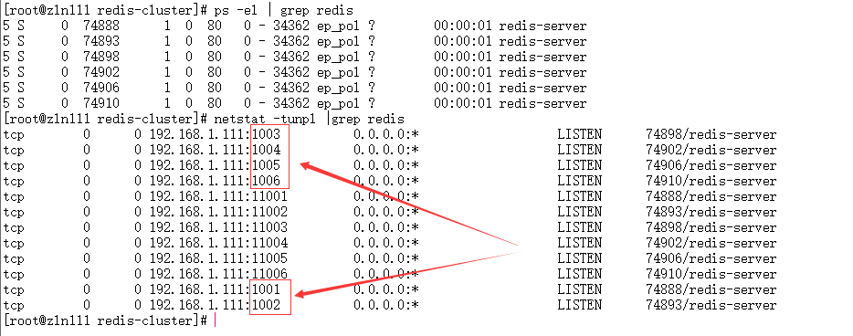

第五步：首先到redis3.0的安装目录下，然后执行redis-trib.rb命令
```
cd /usr/local/redis3.0/src
./redis-trib.rb create --replicas 1 192.168.1.111:1001 192.168.1.111:1002 192.168.1.111:1003 192.168.1.111:1004 192.168.1.111:1005 192.168.1.111:1006
```

这里的1表示主从分配的比例，1表示集群的实例数是按照1:1的比例分配（主/从），当前是6个实例，那么结果是三主三从。如果这里设置为2，那么最小需要增加3个实例（主节点最少为三个，比例为2的最少组合是3主6从)。


如图集群就算是搭建成功了：

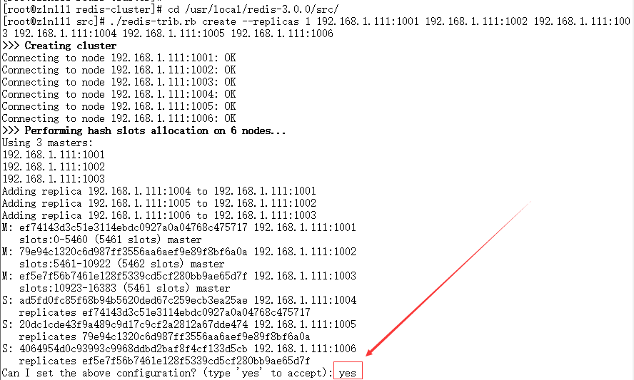

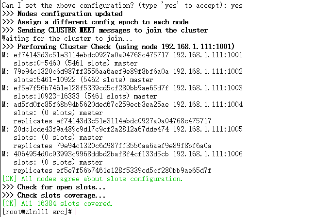

如上图所示，redis集群脚本已经帮我们自动划分好集群了，最下方是询问我们是否同意这种分配方式，如果同意的我们选yes

我们可以看到master节点的节点信息都有一个slots,这个我们可以形象的理解为槽位，用于存取数据，而slave却没有，这也能进一步说明，主节点具有读写特性，从节点只有读特性。（具体的原理后期会进行探讨）

搭建集群的时候可能遇到下面的问题，解决如下：
在搭建多机多点集群的时候，遇到以下问题：

1、一直在等待...
```
>>> Nodes configuration updated
>>> Assign a different config epoch to each node
>>> Sending CLUSTER MEET messages to join the cluster
Waiting for the cluster to join.......................
```
解决办法：确认端口是否开放。如果没有开发，可以修改/etc/sysconfig/iptables文件，开放端口（复制一行前面开放端口的来修改），然后service iptables restart重启防火墙。

极端的可以service iptables stop来关闭防火墙

2、槽被利用
```
/usr/local/rvm/gems/ruby-2.3.3/gems/redis-4.0.0/lib/redis/client.rb:119:in `call': ERR Slot 5461 is already busy (Redis::CommandError)
from /usr/local/rvm/gems/ruby-2.3.3/gems/redis-4.0.0/lib/redis.rb:2742:in `block in method_missing'
from /usr/local/rvm/gems/ruby-2.3.3/gems/redis-4.0.0/lib/redis.rb:45:in `block in synchronize'
from /usr/local/rvm/rubies/ruby-2.3.3/lib/ruby/2.3.0/monitor.rb:214:in `mon_synchronize'
from /usr/local/rvm/gems/ruby-2.3.3/gems/redis-4.0.0/lib/redis.rb:45:in `synchronize'
from /usr/local/rvm/gems/ruby-2.3.3/gems/redis-4.0.0/lib/redis.rb:2741:in `method_missing'
from /usr/local/bin/redis-trib.rb:212:in `flush_node_config'
from /usr/local/bin/redis-trib.rb:776:in `block in flush_nodes_config'
from /usr/local/bin/redis-trib.rb:775:in `each'
from /usr/local/bin/redis-trib.rb:775:in `flush_nodes_config'
from /usr/local/bin/redis-trib.rb:1296:in `create_cluster_cmd'
from /usr/local/bin/redis-trib.rb:1100:in `<main>'
```
解决办法：删除掉在redis.conf的dir目录下的几个文件redis.conf文件除外。

 

如果还是有相同的问题，可以考虑对所有节点执行下面两个命令。

redis-cli -p 端口号-h 主机物理地址 FLUSHALL

redis-cli -p 端口号-h 主机物理地址 CLUSTER RESET SOFT

### 集群测试


我们先来查看一下集群信息：

cluster info(查看集群消息)、cluster nodes（查看节点列表）

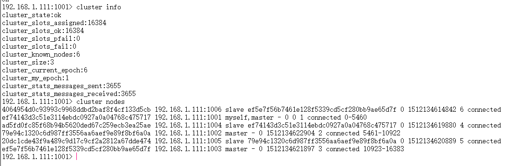

下面我们克隆6个会话，分别连接6个节点：

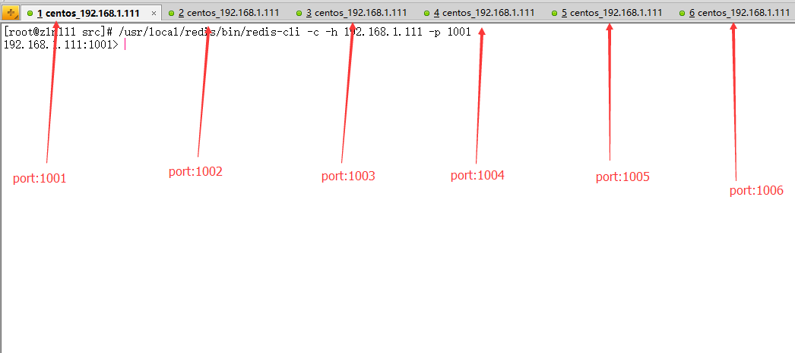

我们来看看我们的连接参数：

redis-cli

redis-cli默认情况下连接的是本地的6379端口的redis服务器。

现在有六个端口，所以需要指定参数。

**redis-cli -h xxx -p xxx -a xxx**
我们来解释一下上面的命令：
-h：指定服务器
-p：指定端口号
-a：指定密码
-c：开启集群模式

下面我们来看测试结果：

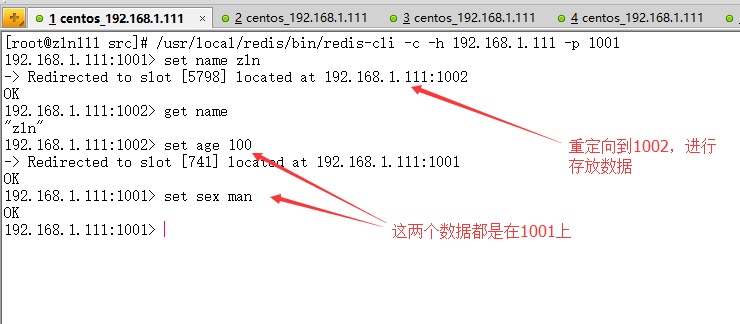


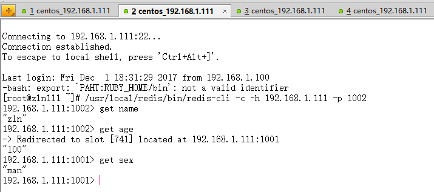

从测试结果看，我们只需要去存放数据，无需考虑我们要把数据存放在哪一个节点，Redis集群会主动帮我们做负载均衡。

## java操作Redis集群(Jedis)


这个之前我们已经上过代码了(我们需要导入Jedis相关的Jar包)，下面根据当前配置环境，我们再来看一下代码:
```java
public class TestClusterRedis {

    public static void main(String[] args) {

        Set<HostAndPort> jedisClusterNode = new HashSet<HostAndPort>();
        jedisClusterNode.add(new HostAndPort("192.168.1.111", 1001));
        jedisClusterNode.add(new HostAndPort("192.168.1.111", 1002));
        jedisClusterNode.add(new HostAndPort("192.168.1.111", 1003));
        jedisClusterNode.add(new HostAndPort("192.168.1.111", 1004));
        jedisClusterNode.add(new HostAndPort("192.168.1.111", 1005));
        jedisClusterNode.add(new HostAndPort("192.168.1.111", 71006));
        //GenericObjectPoolConfig goConfig = new GenericObjectPoolConfig();
        //JedisCluster jc = new JedisCluster(jedisClusterNode,2000,100, goConfig);
        JedisPoolConfig cfg = new JedisPoolConfig();
        cfg.setMaxTotal(100);
        cfg.setMaxIdle(20);
        cfg.setMaxWaitMillis(-1);
        cfg.setTestOnBorrow(true);
        JedisCluster jc = new JedisCluster(jedisClusterNode, 6000, 1000, cfg);

        System.out.println(jc.set("add", "nanjing"));
        System.out.println(jc.set("sex", "男"));
        System.out.println(jc.get("name"));
        System.out.println(jc.get("name"));
        System.out.println(jc.get("name"));
        System.out.println(jc.get("name"));
        System.out.println(jc.get("name"));
        System.out.println(jc.get("name"));
        System.out.println(jc.get("name"));
        System.out.println(jc.get("name"));
        System.out.println(jc.get("age"));
        System.out.println(jc.get("sex"));
        jc.close();
    }
}
```

我们来看操作结果：

```
OK
OK
zln
zln
zln
zln
zln
zln
zln
zln
100
男
```

各位看客可以进行运行一下，运行很快，说明Redis集群的性能不错。


### 集群常用命令

**集群**
```
cluster info ：打印集群的信息
cluster nodes ：列出集群当前已知的所有节点（ node），以及这些节点的相关信息。
```

**节点**
```
cluster meet <ip> <port> ：将 ip 和 port 所指定的节点添加到集群当中，让它成为集群的一份子。
cluster forget <node_id> ：从集群中移除 node_id 指定的节点。
cluster replicate <node_id> ：将当前节点设置为 node_id 指定的节点的从节点。
cluster saveconfig ：将节点的配置文件保存到硬盘里面。
```
**槽(slot)**
```
cluster addslots <slot> [slot ...] ：将一个或多个槽（ slot）指派（ assign）给当前节点。
cluster delslots <slot> [slot ...] ：移除一个或多个槽对当前节点的指派。
cluster flushslots ：移除指派给当前节点的所有槽，让当前节点变成一个没有指派任何槽的节点。
cluster setslot <slot> node <node_id> ：将槽 slot 指派给 node_id 指定的节点，如果槽已经指派给
另一个节点，那么先让另一个节点删除该槽>，然后再进行指派。
cluster setslot <slot> migrating <node_id> ：将本节点的槽 slot 迁移到 node_id 指定的节点中。
cluster setslot <slot> importing <node_id> ：从 node_id 指定的节点中导入槽 slot 到本节点。
cluster setslot <slot> stable ：取消对槽 slot 的导入（ import）或者迁移（ migrate）。
```

**键**
```
cluster keyslot <key> ：计算键 key 应该被放置在哪个槽上。
cluster countkeysinslot <slot> ：返回槽 slot 目前包含的键值对数量。
cluster getkeysinslot <slot> <count> ：返回 count 个 slot 槽中的键  
```

### 集群操作

#### 新加节点
按照之前搭建的集群方式新增2个节点：（一主一从 master、slave） 
​     Master：1007                Slave：1008
​     
步骤一：创建1007/1008文件夹。拷贝redis.conf文件到对于的1007,1008目录下 要			 进行修改配置文件。
```
[root@zln111 redis-cluster]# mkdir 1007
[root@zln111 redis-cluster]# mkdir 1008
[root@zln111 redis-cluster]# cd 1001
[root@zln111 1001]# cp redis.conf /usr/local/redis-cluster/1007/
[root@zln111 1001]# cp redis.conf /usr/local/redis-cluster/1008/
[root@zln111 1001]# vim /usr/local/redis-cluster/1007/redis.conf
[root@zln111 1001]# vim /usr/local/redis-cluster/1008/redis.conf
```
1007/redis.conf修改内容如下：
```
port:1007
dir /usr/local/redis-cluster/1007/
cluster-config-file nodes1007.conf
```

1008/redis.conf修改内容如下：
```
port:1008
dir /usr/local/redis-cluster/1008/
cluster-config-file nodes1008.conf
```

步骤二：启动1007和1008这2个服务并查看服务状态。
```
[root@zln111 1001]# /usr/local/redis/bin/redis-server /usr/local/redis-cluster/1007/redis.conf 
[root@zln111111 1001]# /usr/local/redis/bin/redis-server /usr/local/redis-cluster/1008/redis.conf 
```

查看：

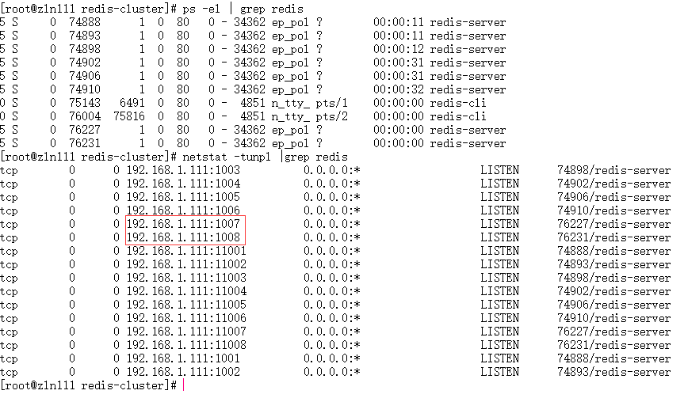

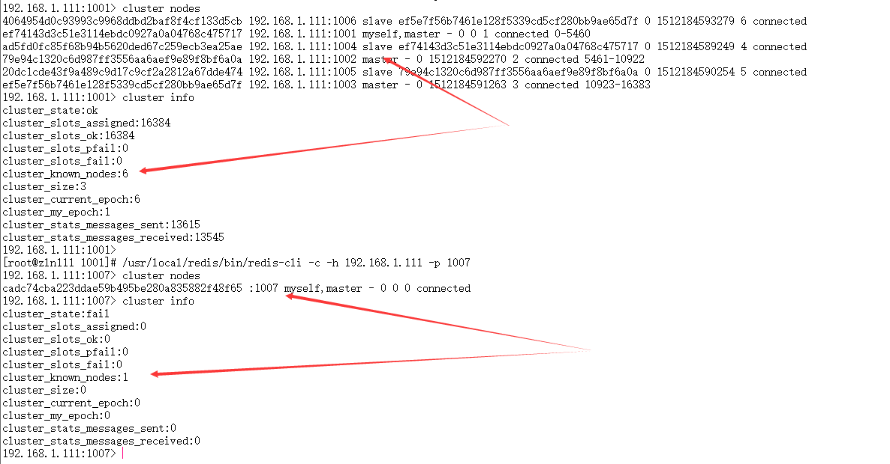

我们发现虽然1007和1008节点启动了，但是并没有加入到集群中，要向加入到集群，就需要redis-trib的命令操作了


#### redis-trib命令使用
```
[root@zln111 local]# cd /usr/local/redis-3.0.0/src
[root@zln111 src]# ./redis-trib.rb
```
命令参数如下：

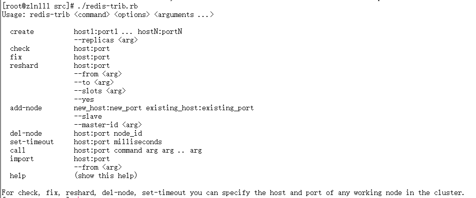

下面来稍微解释一下常用的命令：
1 create：创建一个集群环境host1:port1 ... hostN:portN（集群中的主从节点比例）
2 call：可以执行redis命令
3 add-node：将一个节点添加到集群里，第一个参数为新节点的ip:port，第二个参数为集群中任意一个已经存在的节点的ip:port
4 del-node：移除一个节点
5 reshard：重新分片(分配槽位)
6 check：检查集群状态

#### 将Master节点加入到集群

我们来新增一个主节点1007（master）：

步骤一：使用add-node命令：绿色为新增节点，红色为已知存在节点
```
[root@zln111 src]# 
/usr/local/redis-3.0.0/src/redis-trib.rb add-node 192.168.1.111:1007 192.168.1.111:1001
```
192.168.1.111:1001表示集群中任意的一个节点
192.168.1.111:1007表示新加入的节点

操作结果如下：

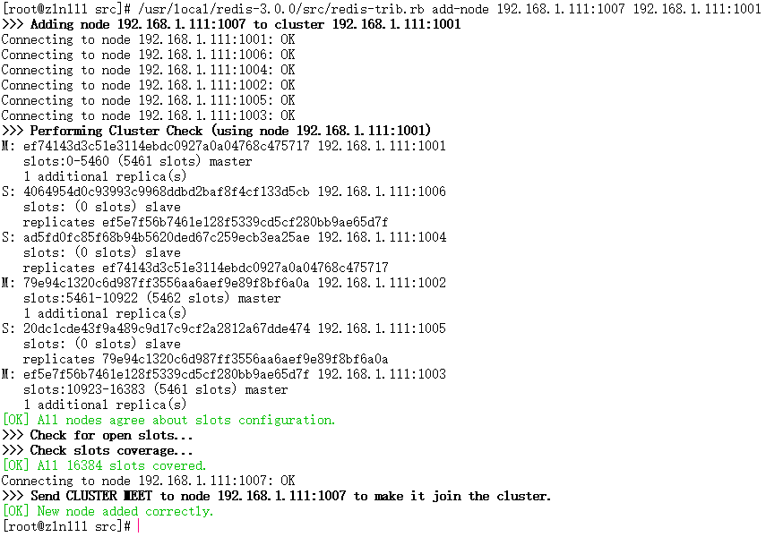

步骤二：查看集群状态：

```
[root@zln111 src]# /usr/local/redis/bin/redis-cli -c -h 192.168.1.111 -p 1001
192.168.1.111:1001> cluster  nodes
```
注意：当添加节点成功以后，新增的节点不会有任何数据，因为它没有分配任何的slot（hash槽）。我们需要为新节点手工分配slot。

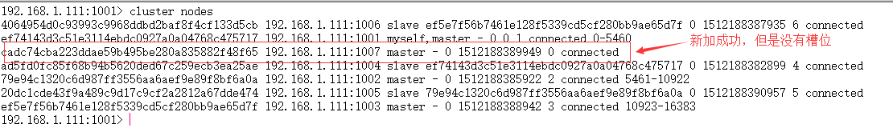

#### 为新加入的Master分配slot槽

步骤一：使用redis-trib命令，找到集群中的任意一个**主节点**，对其进行重新分片工作。
```
[root@zln111 src]# /usr/local/redis-3.0.0/src/redis-trib.rb reshard 192.168.1.111:1001
```
输出如下:

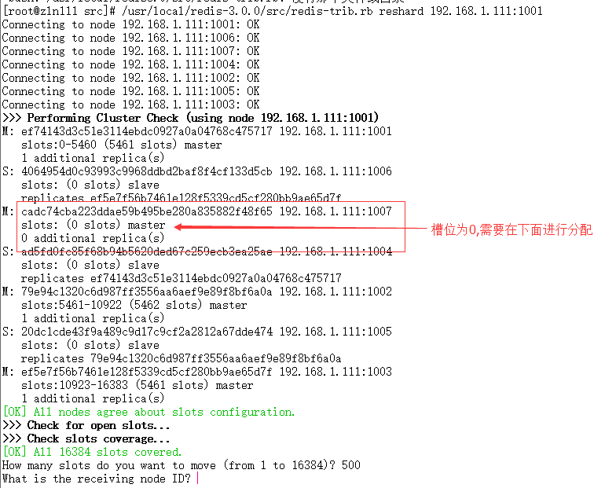

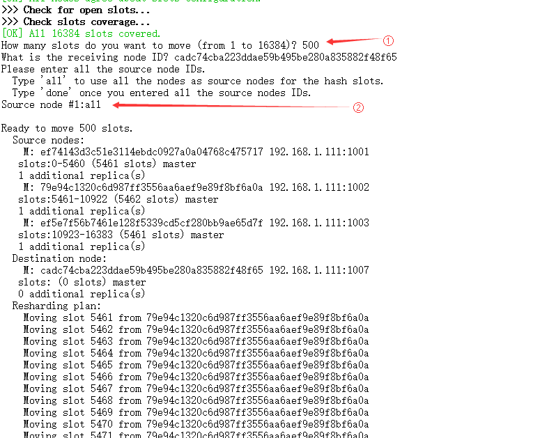

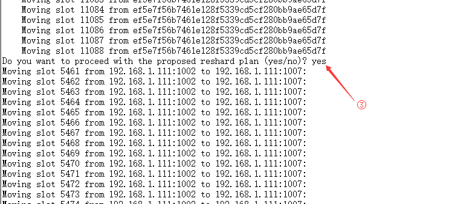

我们对上面的①，②，③进行解释一下：

①：是希望你需要多少个槽移动到新的节点上，可以自己设置，比如500个槽。
②：是你需要把这500个slot槽移动到那个节点上去（需要指定节点id），并且下个提示是输入all为从所有主节点（1001 1002 1003）中分别抽取响应的槽数（一共为500个槽到指定的新节点中，并且会打印执行分片的计划。）

③：输入yes确认开始执行分片任务。在最后我们再次看一下集群状态：

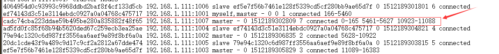

如上图所示，现在我们的1007已经有slot槽了，也就是说可以在1007上进行读写数据啦！到此为止我们的1007已经加入到集群中啦，并且是主节点（Master）

我们下面看一下能否将数据放入1007中：

#### 将Slave节点加入到集群

添加从节点（1008）到集群中去，步骤如下：

步骤一：还是需要执行add-node命令：
```
[root@zln111 src]# 
/usr/local/redis-3.0.0/src/redis-trib.rb add-node 192.168.1.111:1008 192.168.1.111:1001
```
结果如下:

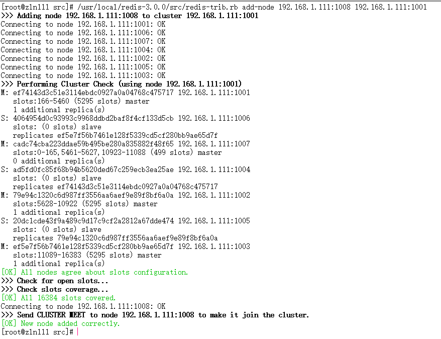

提示添加成功后我们继续看一下集群的状态:

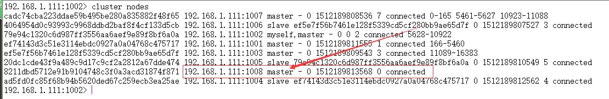

如图所示，还是一个master节点，没有被分配任何的slot槽。


步骤二：我们需要执行replicate命令来指定当前节点（从节点）的主节点id为哪个。
首先需要登录新加的1008节点的客户端，然后使用集群命令进行操作，把当前的1008（slave）节点指定到一个主节点下（这里使用之前创建的1007主节点,也就是下方的cadc74cba223ddae59b495be280a835882f48f65）

```
[root@zln111 src]# /usr/local/redis/bin/redis-cli -c -h 192.168.1.111 -p 1008
192.168.1.111:1008> cluster replicate cadc74cba223ddae59b495be280a835882f48f65
192.168.1.111:1008> 
OK（提示OK则操作成功）
```
我们继续看一下当前集群的状态，如下图：我们已经成功的把1008放到1007这个主节点下面了，到此为止我们已经成功的添加完一个从节点了。

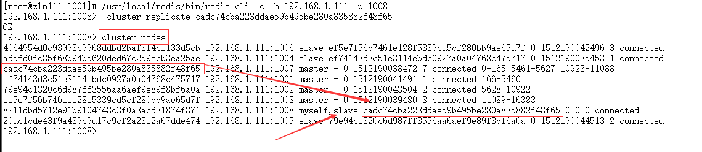

#### 将新加入集群的slave节点移除

我们现在尝试删除一个节点（1008 slave）
步骤一：删除从节点1008，输入del-node命令，指定删除节点ip和端口，以及节点id（8211dbd5712e91b9104748c3f0a3acd31874f871）
```
[root@zln111 src]# /usr/local/redis-3.0.0/src/redis-trib.rb del-node 192.168.1.111:1008 8211dbd5712e91b9104748c3f0a3acd31874f871
```
操作如下：


步骤二：再次查看一下集群状态，如下图所示，我们已经成功的移除了1008 slave节点，另外我们发现移除一个节点以后，当前节点的服务进程也会随之销毁。可以使用ps命令查看当前的服务（ps -el | grep redis），发现少了一个运行的server，也就是刚移除的1008从节点。

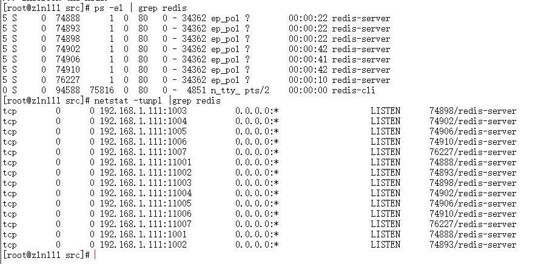


#### 将新加入集群的master节点移除

我们尝试删除之前加入的主节点1007，这个步骤会相对比较麻烦一些，因为主节点的里面是有分配了slot槽的，所以我们这里必须先把1007里的slot槽放入到其他的可用主节点中去，然后再进行移除节点操作才行，不然会出现数据丢失问题。

步骤一：删除1007（master）节点之前，我们需要先把其全部的数据（slot槽）移动到其他节点上去（redis3.0.0只能把master的数据迁移到一个节点上，暂时做不了平均分配功能）。

```
[root@zln111 src]# /usr/local/redis-3.0.0/src/redis-trib.rb reshard 192.168.1.111:1007
```

操作如下：

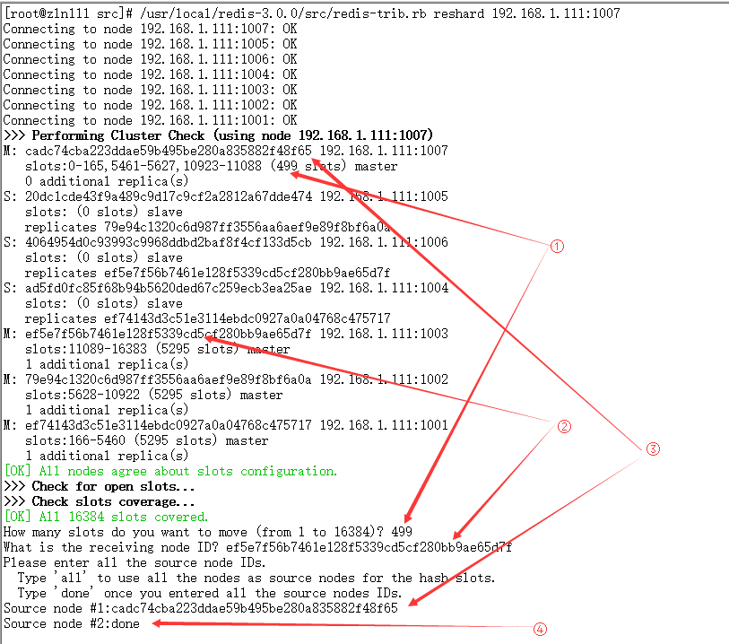

①：这里不会是正好500个槽，一般来说少一个，也就是499

②：这里是需要把数据移动到哪？1001的主节点id

③：这里是需要数据源，也就是我们的1007节点id

④：这里直接输入done 开始生成迁移计划(不能使用all)

到此为止我们已经成功的把1007主节点的数据迁移到1001上去了，我们可以看一下现在的集群状态如下图，你会发现1007下面已经没有任何数据（slot）槽了，证明迁移成功！


步骤二：最后我们直接使用del-node命令删除1007主节点即可（cadc74cba223ddae59b495be280a835882f48f65）
```
[root@zln111 ~]# /usr/local/redis-3.0.0/src/redis-trib.rb del-node 192.168.1.111:1007 cadc74cba223ddae59b495be280a835882f48f65
```

操作结果如下：

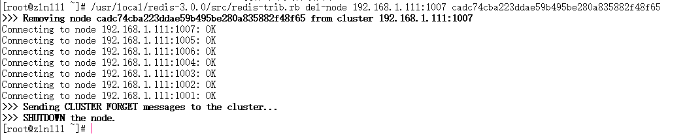

最后：我们查看集群状态，一切还原为最初始状态(槽位略有变化)

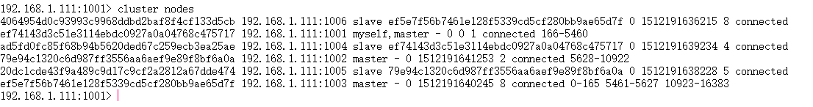


## Spring整合Redis集群

Spring整合Redis集群其实相对来说比较简单，首先一点是引入jedis的jar包，其次和上面Jedis代码差不多，只是，初始化代码变成在xml中配置完成，我们根据当前的环境配置如下：

applicationContext-cluster.xml

```xml
<?xml version="1.0" encoding="UTF-8"?>
<beans xmlns="http://www.springframework.org/schema/beans"
	xmlns:xsi="http://www.w3.org/2001/XMLSchema-instance" xmlns:p="http://www.springframework.org/schema/p"
	xmlns:context="http://www.springframework.org/schema/context"
	xmlns:jee="http://www.springframework.org/schema/jee" xmlns:tx="http://www.springframework.org/schema/tx"
	xmlns:aop="http://www.springframework.org/schema/aop"
	xsi:schemaLocation="  
            http://www.springframework.org/schema/beans http://www.springframework.org/schema/beans/spring-beans.xsd  
            http://www.springframework.org/schema/context http://www.springframework.org/schema/context/spring-context.xsd">

	<context:property-placeholder location="classpath:redis.properties" />
	<context:component-scan base-package="com.x.redis.dao">
	</context:component-scan>
	<bean id="jedisPoolConfig" class="redis.clients.jedis.JedisPoolConfig">
		<property name="maxIdle" value="${redis.maxIdle}" />
		<property name="maxTotal" value="${redis.maxActive}" />
		<property name="maxWaitMillis" value="${redis.maxWait}" />
		<property name="testOnBorrow" value="${redis.testOnBorrow}" />
	</bean>

	<bean id="hostport1" class="redis.clients.jedis.HostAndPort">
		<constructor-arg name="host" value="192.168.1.111" />
		<constructor-arg name="port" value="1006" />
	</bean>
	<bean id="hostport2" class="redis.clients.jedis.HostAndPort">
		<constructor-arg name="host" value="192.168.1.111" />
		<constructor-arg name="port" value="1001" />
	</bean>
	<bean id="hostport3" class="redis.clients.jedis.HostAndPort">
		<constructor-arg name="host" value="192.168.1.111" />
		<constructor-arg name="port" value="1002" />
	</bean>
	<bean id="hostport4" class="redis.clients.jedis.HostAndPort">
		<constructor-arg name="host" value="192.168.1.111" />
		<constructor-arg name="port" value="1003" />
	</bean>
	<bean id="hostport5" class="redis.clients.jedis.HostAndPort">
		<constructor-arg name="host" value="192.168.1.111" />
		<constructor-arg name="port" value="1004" />
	</bean>
	<bean id="hostport6" class="redis.clients.jedis.HostAndPort">
		<constructor-arg name="host" value="192.168.1.111" />
		<constructor-arg name="port" value="1005" />
	</bean>

	<bean id="redisCluster" class="redis.clients.jedis.JedisCluster">
		<constructor-arg name="nodes">
			<set>
				<ref bean="hostport1" />
				<ref bean="hostport2" />
				<ref bean="hostport3" />
				<ref bean="hostport4" />
				<ref bean="hostport5" />
				<ref bean="hostport6" />
			</set>
		</constructor-arg>
		<constructor-arg name="timeout" value="6000" />
		<constructor-arg name="poolConfig">
			<ref bean="jedisPoolConfig" />
		</constructor-arg>
	</bean>
</beans>
```
配置文件比较简单，熟悉Spring的童鞋应该都能看懂。

## 基于Redis的Session共享

session基于redis共享有两种基本的方案 

1、基于容器自身的扩展，比如tomcat的session-manage，可以参考如下 
地址进行配置https://github.com/jcoleman/tomcat-redis-session-manager 

这个方案只适用tomcat容器，而且容器需要配置，这里不具体展开，有需要的可以参考上面的地址进行配置。但是这个方案有一个好处，可以适用于struts2和springmvc的场景，而且对springmvc没有版本要求。


2、基于spring-session的方案，spring-session的好处不仅仅是session共享，它还可以应用于多终端session共享，websocket，restful api等场景。下面具体说明一下 
配置。特别说明spring-session是基于springmvc4.0以后的版本的，所以版本不匹配的就不能使用。

mave配置
```
<dependency>
        <groupId>org.springframework.session</groupId>
        <artifactId>spring-session-data-redis</artifactId>
        <version>1.2.2.RELEASE</version>
        <type>pom</type>
</dependency>
<dependency>
        <groupId>org.springframework</groupId>
        <artifactId>spring-web</artifactId>
        <version>4.2.9.RELEASE</version>
</dependency>
```

spring.xml
```
<bean id="redisHttpSessionConfiguration"  class="org.springframework.session.data.redis.config.annotation.web.http.RedisHttpSessionConfiguration" >
    <property name="maxInactiveIntervalInSeconds" value="1800" />
</bean>

<bean class="org.springframework.data.redis.connection.jedis.JedisConnectionFactory">
    <property name="hostName" value="192.168.17.24" />
    <property name="port" value="6379" />
</bean>
```

web.xml

```
<!-- 分布式Session共享Filter -->
<filter>
    <filter-name>springSessionRepositoryFilter</filter-name>
    <filter-class>org.springframework.web.filter.DelegatingFilterProxy</filter-class>
</filter>

<filter-mapping>
    <filter-name>springSessionRepositoryFilter</filter-name>
    <url-pattern>/*</url-pattern>
    <dispatcher>REQUEST</dispatcher>
    <dispatcher>ERROR</dispatcher>
</filter-mapping>
```