# Redis基础知识（二）

> data:2018.11.08

## Redis高级命令

1、测试是否连接到redis

1）ping，返回pong，说明连接成功；

2）echo hi ，交互模式，若返回hi，说明连接成功。此命令可以理解为打印，注意打印的字符串中不能有空格。

2、返回满足的所有键 keys * （可以模糊匹配）

3、**exists** 是否存在指定的key

4、**expire** 设置某个key的过期时间，使用ttl查看剩余时间
`expire name 10` ： name 10s过期

5、**persist** 取消过期时间

操作结果如下：

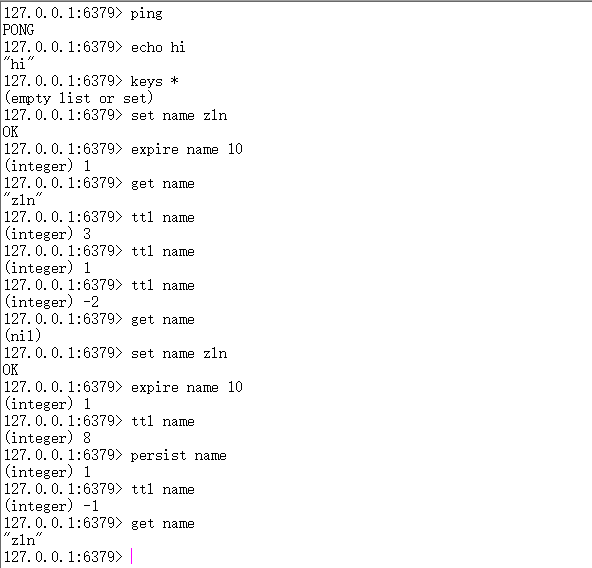

6、**select** 选择数据库 数据库为0到15（一共16个数据库）默认进入的是0数据库

7、**move** [key][数据库下标]将当前数据中的key 转移到其他数据库中

8、**randomkey** 随机返回数据库里的一个key

9、**rename** 重命名key

10、**dbsize** 查看数据库的key数量

11、**info** 获取数据库信息

12、`config get` 实时传储收到的请求(返回相关的配置信息) `config get *` 返回所有配置

13、**flushdb** 清空当前数据库

14、**flushall** 清空所有数据库

操作结果如下：

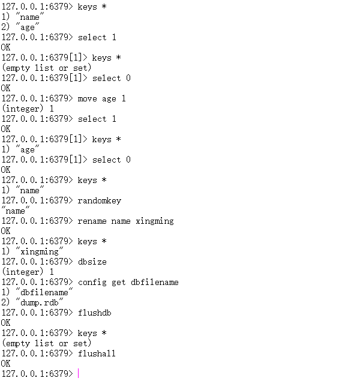

下面，我们重点来看看info的操作：

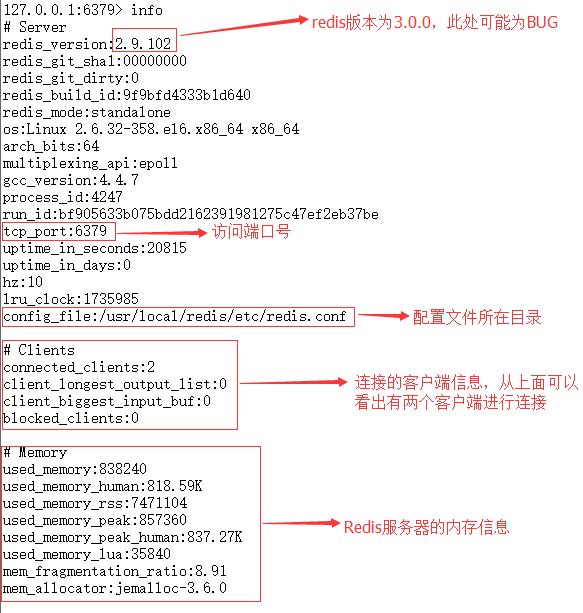

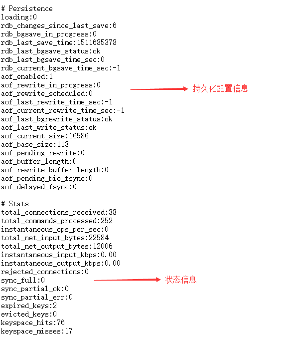

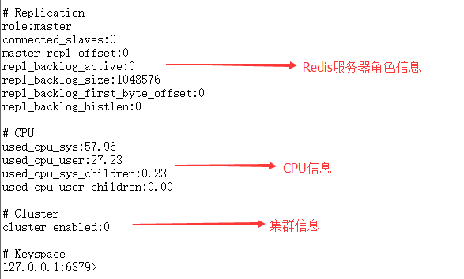

我们上面看到，Redis服务器最多支持16个数据库，这有利于我们对数据进行分类储存，同时数据也起到了隔离的作用，例如，将List类型的数据库存入库1，Hash数据类型存入库2.同时，我们也可以在16个数据库的基础上增加数据库示例，具体的在redis.conf中进行配置。

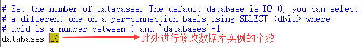

## Redis安全性

redis速度相当快，所以在一台比较好的服务器下，一个外部用户在一秒内可以进行**15W次**的密码尝试，这意味着你需要设定非常强大的密码来防止暴力破解。

vi编辑 redis.conf文件 找到下面进行保存修改 
```
#requirepass foobared 
requirepass **** 
```

重启服务器， 再次进入,发现
```
127.0.0.1:6379> keys *
(error) NOAUTH Authentication required.
```
会发现没有权限进行查询.

```
127.0.0.1:6379> auth aaa 
OK
```
输入密码则成功进入 每次进入的时候都要输入密码，还有种简单的方式： 还有种方式是直接登录授权：
`[root@zln110 ~]# /usr/local/redis/bin/redis-cli -a aaa`

其实，个人感觉Redis不需要设置密码，因为Redis一般部署在内网环境中，外网无法直接进行访问。


## Redis主从复制

### 主从复制介绍

1、Master可以拥有多个slave

2、多个slave可以连接同一个master外，还可以连接其他的salve

3、主从复制不会阻塞master在同步数据时，master可以继续处理client请求

4、提供系统的伸缩性

### 主从复制过程

1、slave与master建立连接，发送sync同步命令

2、master会开启一个后台进程，将数据库快照保存到文件中，同时master主进程会开始收集新的写命令并缓存

3、后台完成保存后，就将文件发送给slave

4、slave将此文件保存到硬盘上

### 主从复制配置

首先我们来看一下具体的主从复制环境：

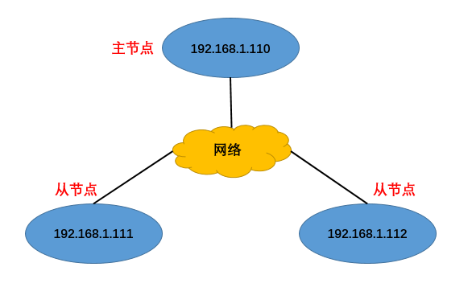

我们目前只有一台，192.168.1.110（后面一律称之为host110）这台虚拟机，因此需要克隆两台虚拟机，克隆时注意以下几点：
1.克隆后，开机前需要进行修改MAC地址（右击设置-->网络适配器-->高级-->MAC地址生成）
2.修改ip地址，本人虚拟机用的是centos，以host111为例，配置如下：

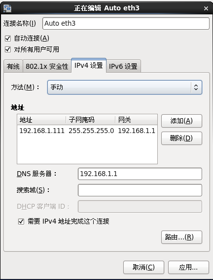

3.修改用户名，然后重启

4.重启完成后需要开启ssh服务（便于远程连接）

5.需要注意的是，所有虚拟机都禁用防火墙，防止Redis服务器之间无法进行后续交互

最终结果是所有虚拟机能够相互通信，如下所示：

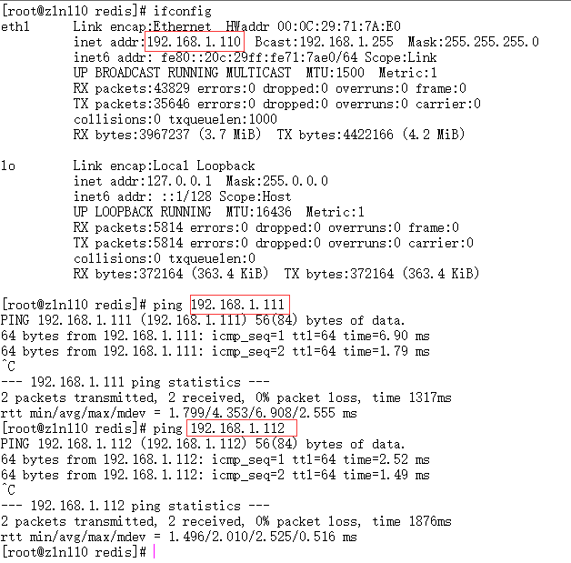

下面开始进行真正的配置：

由于虚拟机是克隆的，所以每台虚拟机都已经安装好Redis,主节点不需要任何配置，只需要配置两个从节点的redis.conf文件（在redis/etc目录下），从节点配置如下：


如果master有密码的话，我们要进行设置密码：`masterauth<master-password>`

下面进行开启三个节点的Redis服务器和客户端：
服务端开启命令：/usr/local/redis/bin/redis-server /usr/local/redis/etc/redis.conf

客户端开启命令：/usr/local/redis/bin/redis-cli

我们来看看主节点host111的info信息：

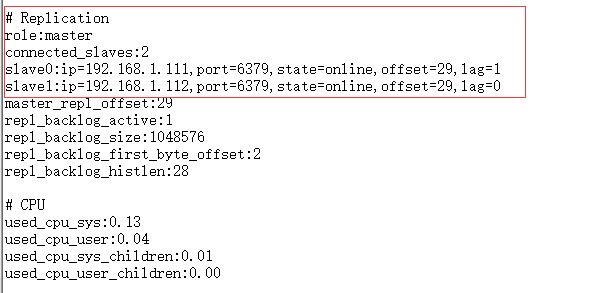

从图上可知host110的角色为master，并且有两个slave节点。

我们再来看一下从节点（以host111为例）：

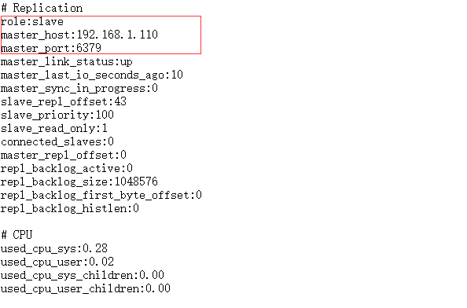


### 主从复制验证

下面我们来看看主从节点的数据同步：

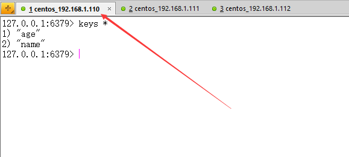

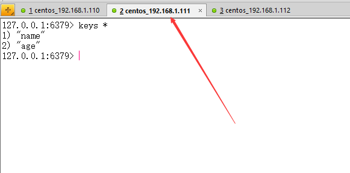

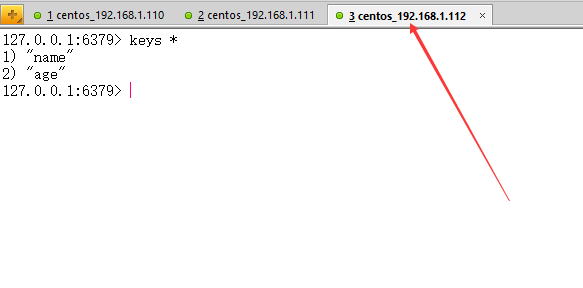

还记得我们上一篇文章的主从复制的图吗？我们再来看一下：

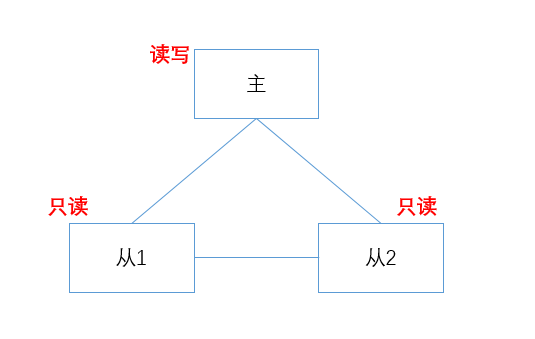

从上图我们可以看出，主节点具备读写操作，从节点只具备读操作。

我们来验证一下：

我们先来看主节点：

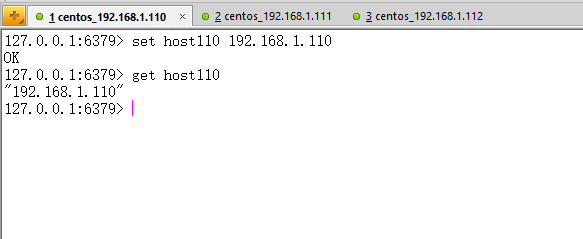

我们可以看出Redis主节点具备读写的特性

我们下面来看一下从节点：

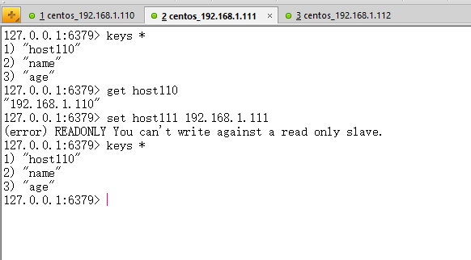

我们看到，从节点能够正常读数据，写入数据却开始报错，证明其只能读，不能进行写操作。


## Redis哨兵机制

### 哨兵机制介绍

有了主从复制的实现以后，我们如果相对主从服务器进行监控，那么在redis2.6以后提供了一个“哨兵”的机制，在2.8之后，哨兵功能开始稳定。

哨兵的含义就是监控redis系统的运行状况。其**主要功能**有两点：

1 监控主数据库和从数据库是否正常运行。

2 主数据库出现故障时，可以自动将从数据库转换为主数据库，实现自动切换。

### 哨兵机制实现

在一台服务器配置sentinel.conf，这个服务器可以是主从节点，也可以是新的服务器，我这边新开一台服务器当做哨兵节点，同样的哨兵节点也需要Redis，哨兵的网络拓扑图，如下图所示：

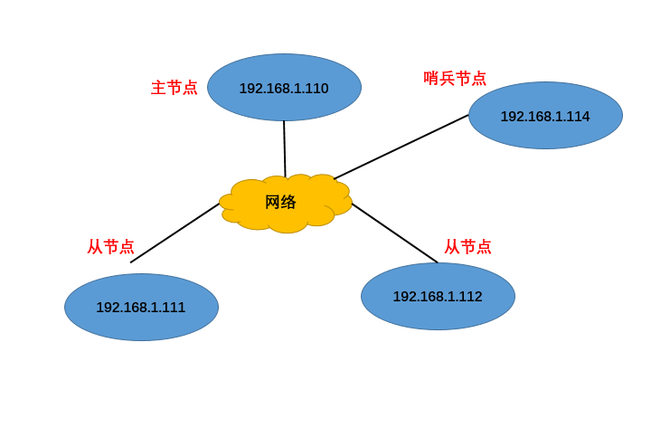

下面我们来看详细的配置：

1)copy文件`sentinel.conf`到`/usr/local/redis/etc`中（sentinel.conf在之前编译的redis目录下）

2)修改sentinel.conf

1.**sentinel monitor mymaster 192.168.1.110 6379 1**
mymaster代表名称、
192.168.1.110代表主节点ip、
6379代表主节点的Redis端口号、
1代表投票选举次数

2.**sentinel down-after-milliseconds mymaster 5000**
这个配置项指定了需要多少失效时间，一个master才会被这个sentinel主观地认为是不可用的。 单位是毫秒默认1s检测一次，这里配置超时5000毫秒为宕机

3.**sentinel failover-timeout mymaster 9000000**
ailover-timeout 可以用在以下这些方面： 
①. 同一个sentinel对同一个master两次failover之间的间隔时间。
②. 当一个slave从一个错误的master那里同步数据开始计算时间。直到slave被纠正为向正确的master那里同步数据时。
③.当想要取消一个正在进行的failover所需要的时间。  
④.当进行failover时，配置所有slaves指向新的master所需的最大时间。不过，即使过了这个超时，slaves依然会被正确配置为指向master，但是就不按parallel-syncs所配置的规则来了

4.**sentinel parallel-syncs mymaster 2**
这个配置项指定了在发生failover主备切换时最多可以有多少个slave同时对新的master进行同步，这个数字越小，完成failover所需的时间就越长，但是如果这个数字越大，就意味着越多的slave因为replication而不可用。简单来说，2就是从节点的数量。


5.**sentinel auth-pass `<master-name>` `<password>`**
设置连接master和slave时的密码，注意的是sentinel不能分别为master和slave设置不同的密码，因此master和slave的密码应该设置相同。
因为没有密码，所以无需设置此项。

3)设置启动sentinel哨兵 

`/usr/local/redis/bin/redis-server /usr/local/redis/etc/sentinel.conf --sentinel `

注意：启动时出现**+sdown slave 192.168.1.112:6379 192.168.1.112 6379 @ mymaster 192.168.1.110 6379** 表明端口被防火墙禁用，此时需要对主从节点和哨兵节点进行禁用防火墙操作。

启动结果如下图所示：

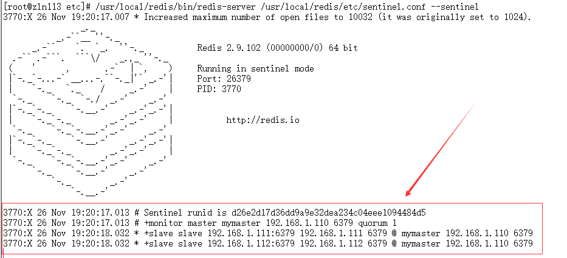

4)查看哨兵相关信息命令(各节点)

`/usr/local/redis/bin/redis-cli -h 192.168.1.113 -p 26379 info Sentinel`
192.168.1.113 为哨兵节点ip
26397为哨兵节点的端口，可以在sentinel.conf进行配置

我们来看看哨兵信息：

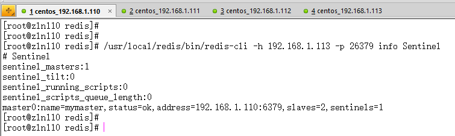


我们也能从上面可以看到主节点ip和从节点的个数。

5）下面我们来断开主节点，看看从节点的的选举，我们看看哨兵节点的运行信息：

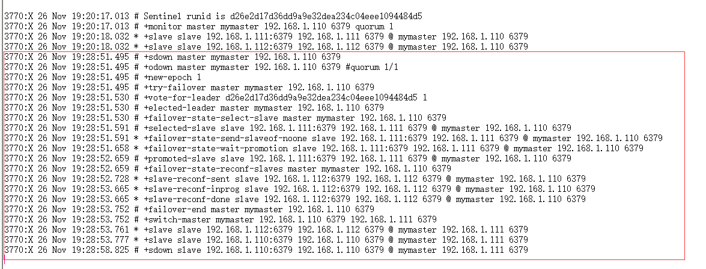

我们可以看出，两个从节点已经开始重新选举主节点。

我们看看host111的info信息：

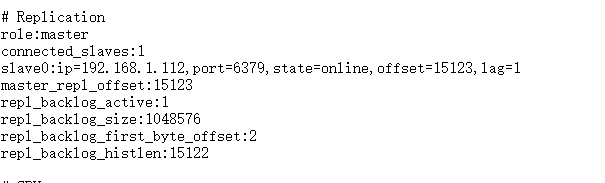

我们发现host111代替host110，成为主节点。

我们从哨兵消息也能看出来：

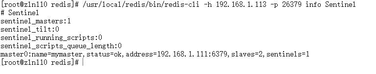

下面，我们重新启动原来的主节点host110,看看是否会重新将host110选举为主节点：

我们来看哨兵节点的日志信息：

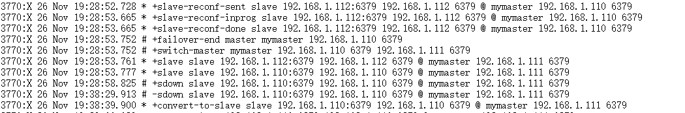

我们从上图看到这句：convert-to-slave slave 192.168.1.110，说明host110并没有经过选举，而是直接转为slave

我们再来看一下host111的info信息：

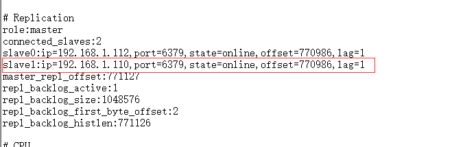

从上图看，host110确实变成了从节点。

## Redis简单事务

redis对事务的支持目前还比较简单。redis只能保证一个client发起的事务中的命令可以连续的执行，而中间不会插入其他client的命令。

由于redis是单线程来处理所有client的请求的所以做到这点是很容易的。一般情况下redis在接受到一个client发来的命令后会立即处理并返回处理结果，但是当一个client在一个连接中发出multi命令有，这个连接会进入一个事务上下文，该连接后续的命令并不是立即执行，而是先放到一个队列中。当从此连接受到exec命令后，redis会顺序的执行队列中的所有命令。并将所有命令的运行结果打包到一起返回给client.然后此连接就 结束事务上下文。下面可以看一个例子

```
redis> multi
OK
redis> incr a
QUEUED
redis> incr b
QUEUED
redis> exec
1. (integer) 1
2. (integer) 1
```

从这个例子我们可以看到incr a ,incr b命令发出后并没执行而是被放到了队列中。调用exec后俩个命令被连续的执行，最后返回的是两条命令执行后的结果

我们可以调用discard命令来取消一个事务。接着上面例子

```
redis> multi
OK
redis> incr a
QUEUED
redis> incr b
QUEUED
redis> discard
OK
redis> get a
"1"
redis> get b
"1"
```
可以发现这次incr a incr b都没被执行。discard命令其实就是清空事务的命令队列并退出事务上下文。
  虽说redis事务在本质上也相当于序列化隔离级别的了。但是由于事务上下文的命令只排队并不立即执行，所以事务中的写操作不能依赖事务中的读操作结果。

还有要注意的是，某条命令即使是失败了，其他命令也会执行，只是把失败的命令报错，比如：

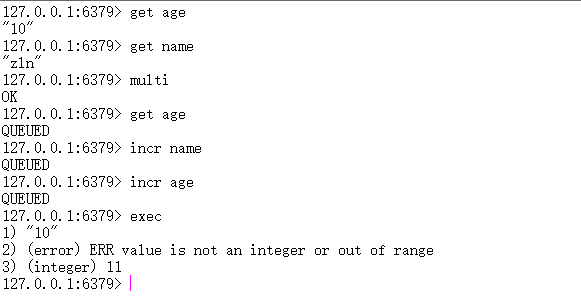

### Redis持久化

redis是一个支持持久化的内存数据库，也就是说redis需要经常将内存中的数据同步到硬盘来保证持久化。

redis持久化的两种方式。

**1.snapshotting(快照)(rdb)**
默认方式，将内存中以快照的方式写入到二进制文件中，默认为dump.rdb。可以通过配置设置自动做快照持久化的方式。配置redis在n秒内如果超过m个key则修改就自动做快照。

snapshotting 设置：

save 900 1 #900秒内，如果超过1个key被修改，则发起快照保存
save 300 10 #300秒内，如果超过10个key被修改，则发起快照保存
save 60 10000

**2.append-only file(缩写aof)** 

(类似于oracle日志)由于快照方式是在一定时间间隔做一次，所以可能发生redis意外down的情况就会丢失最后一次快照后的所有修改的数据，aof比快照方式有更好的持久化，是因为在使用aof时，redis会将每一个收到的写命令都通过write函数追加到命令中，当redis重新启动时，会重新执行文件中保存的写命令来在内存中重建这个数据库的内容。这个文件在bin目录下：

appendonly.aof. aof不是立即写到硬盘上，可以通过配置文件修改强制写到硬盘中。

**aof设置**：

**appendonly yes** ：如果不设置就是第一种快照方式

**启动aof持久化方式有三种修改方式**

**appengfsync always**:收到写命令就立即写入到磁盘，效率最慢，但是保证完全的持久化

**appengfsync everysec**:每秒钟写入磁盘一次，在性能和持久化方面做了折中

**appengfsync no**:完全依赖os 性能最好，持久化没保证

我们推荐使用aof的第一种方式，这种方式虽然效率比较低（x相对于另外两种来说），但是能够使数据不被丢失。

## 发布与订阅消息

redis提供了简单的发布订阅功能

使用subscribe [频道] 进行订阅监听

使用publish [频道] [发布内存] 进行发布消息广播

登录redis客户端，就能发布相应信息。

下面我们进行消息订阅和发布：

我们开三个命令窗，其中两个为订阅窗，一个为发布窗

我们先来订阅消息：

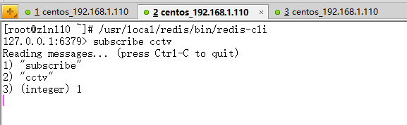


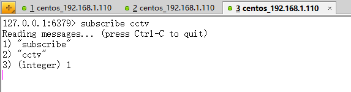


下面，我们来发布消息：

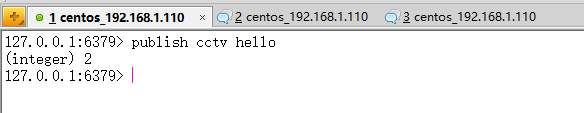

我们从上图可以看出，另外两个窗口都有新消息，我们来打开其中任意一个：

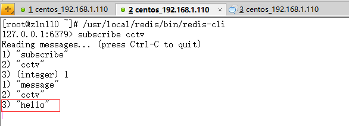

说明订阅的已经得到发布的消息。


## Jedis

Jedis就是Redis支持java的第三方类库，我们可以使用Jedis类库操作Redis数据库。大体在3.0之前，我们是使用Jedis操作数据库的API比较全面。但是目前JAVA第三方可用类库更新比较缓慢，不太全面的Jedis2.7版本才支持集群操作，下面我们通过一个个小demo来揭示Jedis的使用。

在写代码之前，主要使用的Jar包如下图所示：

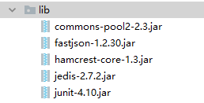

### Jedis连接Redis

下面我们先来测试一下Jedis连接：
```java
private static Jedis jedis = new Jedis("192.168.1.110", 6379);

@Test
public void test1() {
    System.out.println(jedis);
}
```

输出结果：
```
redis.clients.jedis.Jedis@4f8e5cde
```

### Jedis操作String类型

```java
@Test
public void testString() {
    //-----添加数据----------  
    jedis.set("name", "zln");//向key-->name中放入了value-->zln
    System.out.println(jedis.get("name"));//执行结果：zln

    jedis.append("name", " is my lover"); //拼接
    System.out.println(jedis.get("name"));

    jedis.del("name");  //删除某个键
    System.out.println(jedis.get("name"));

    //设置多个键值对
    jedis.mset("name", "bhz", "age", "27", "qq", "174754613");

    jedis.incr("age"); //进行加1操作

    System.out.println(jedis.get("name") + "-" + jedis.get("age") + "-" + jedis.get("qq"));
}
```

### Jedis使用Hash类型

```java
@Test
public void testMap() {

    //-----添加数据----------  
    Map<String, String> map = new HashMap<String, String>();
    map.put("name", "xinxin");
    map.put("age", "22");
    map.put("qq", "123456");

    jedis.hmset("user", map);

    //取出user中的name，执行结果:[minxr]-->注意结果是一个泛型的List  
    //第一个参数是存入redis中map对象的key，后面跟的是放入map中的对象的key，后面的key可以跟多个，是可变参数  

    List<String> rsmap = jedis.hmget("user", "name", "age", "qq");

    System.out.println(rsmap);

    //删除map中的某个键值
    jedis.hdel("user", "age");

    System.out.println(jedis.hmget("user", "age")); //因为删除了，所以返回的是null
    System.out.println(jedis.hlen("user")); //返回key为user的键中存放的值的个数2 
    System.out.println(jedis.exists("user"));//是否存在key为user的记录 返回true  
    System.out.println(jedis.hkeys("user"));//返回map对象中的所有key  
    System.out.println(jedis.hvals("user"));//返回map对象中的所有value 

    Iterator<String> iter = jedis.hkeys("user").iterator();
    while (iter.hasNext()) {
        String key = iter.next();
        System.out.println(key + ":" + jedis.hmget("user", key));
    }
}
```

运行结果：
```
[xinxin, 22, 123456]
[null]
2
true
[qq, name]
[123456, xinxin]
qq:[123456]
name:[xinxin]
```


### Jedis操作List类型

```java
@Test
public void testList() {
    //开始前，先移除所有的内容  
    jedis.del("java framework");
    System.out.println(jedis.lrange("java framework", 0, -1));
    //先向key java framework中存放三条数据  
    jedis.lpush("java framework", "spring");
    jedis.lpush("java framework", "struts");
    jedis.lpush("java framework", "hibernate");
    //再取出所有数据jedis.lrange是按范围取出，  
    // 第一个是key，第二个是起始位置，第三个是结束位置，jedis.llen获取长度 -1表示取得所有  
    System.out.println(jedis.lrange("java framework", 0, -1));

    jedis.del("java framework");
    jedis.rpush("java framework", "spring");
    jedis.rpush("java framework", "struts");
    jedis.rpush("java framework", "hibernate");
    System.out.println(jedis.lrange("java framework", 0, -1));
}
```

运行结果：
```
[]
[hibernate, struts, spring]
[spring, struts, hibernate]

```

### Jedis操作Set类型

```java
@Test
public void testSet() {
    //添加  
    jedis.sadd("user", "liuling");
    jedis.sadd("user", "xinxin");
    jedis.sadd("user", "ling");
    jedis.sadd("user", "zhangxinxin");
    jedis.sadd("user", "who");
    //移除noname  
    jedis.srem("user", "who");
    System.out.println(jedis.smembers("user"));//获取所有加入的value  
    System.out.println(jedis.sismember("user", "who"));//判断 who 是否是user集合的元素  
    System.out.println(jedis.srandmember("user"));
    System.out.println(jedis.scard("user"));//返回集合的元素个数  
}
```

运行结果：
```
[xinxin, ling, zhangxinxin, liuling]
false
zhangxinxin
4   
```

### jedis排序

```java
@Test
public void testRLpush() throws InterruptedException {
    //jedis 排序  
    //注意，此处的rpush和lpush是List的操作。是一个双向链表（但从表现来看的）  
    jedis.del("a");//先清除数据，再加入数据进行测试  
    jedis.rpush("a", "1");
    jedis.lpush("a", "6");
    jedis.lpush("a", "3");
    jedis.lpush("a", "9");
    System.out.println(jedis.lrange("a", 0, -1));// [9, 3, 6, 1]
    System.out.println(jedis.sort("a")); //[1, 3, 6, 9]  //输入排序后结果  
    System.out.println(jedis.lrange("a", 0, -1));
}
```

运行结果：
```
[9, 3, 6, 1]
[1, 3, 6, 9]
[9, 3, 6, 1]
```

### Jedis性能测试

```java
@Test
public void testTrans() {
    long start = System.currentTimeMillis();
    Transaction tx = jedis.multi();
    for (int i = 0; i < 1000; i++) {
        tx.set("t" + i, "t" + i);
    }
    //System.out.println(tx.get("t1000").get());

    List<Object> results = tx.exec();
    long end = System.currentTimeMillis();
    System.out.println("Transaction SET: " + ((end - start) / 1000.0) + " seconds");
}
```

运行结果：
```
Transaction SET: 0.051 seconds
```


```java
@Test
public void testPipelined() {
    Pipeline pipeline = jedis.pipelined();
    long start = System.currentTimeMillis();
    for (int i = 0; i < 1000; i++) {
        pipeline.set("p" + i, "p" + i);
    }
    //System.out.println(pipeline.get("p1000").get());
    List<Object> results = pipeline.syncAndReturnAll();
    long end = System.currentTimeMillis();
    System.out.println("Pipelined SET: " + ((end - start) / 1000.0) + " seconds");
}
```

运行结果：
```
Pipelined SET: 0.03 seconds
```

```java
@Test
public void testPipelineTrans() {
    long start = System.currentTimeMillis();
    Pipeline pipeline = jedis.pipelined();
    pipeline.multi();
    for (int i = 0; i < 100000; i++) {
        pipeline.set("" + i, "" + i);
    }
    pipeline.exec();
    List<Object> results = pipeline.syncAndReturnAll();
    long end = System.currentTimeMillis();
    System.out.println("Pipelined transaction SET: " + ((end - start) / 1000.0) + " seconds");
}
```

运行结果：
```
Pipelined transaction SET: 1.579 seconds
```

### Jedis分片

Jedis分片主要是应对多台Redis服务器的的场景，因为在建立连接之前，我们无法知道主从节点，使用分片可以解决这里问题，同时还能达到负载均衡的效果。

```java


public class TestSingleRedis {

    //单独的的redis服务器
    private static Jedis jedis;
    //2.主从、哨兵使用
    private static ShardedJedis shard;
    //连接池
    private static ShardedJedisPool pool;

    @BeforeClass
    public static void setUpBeforeClass() throws Exception {
        //单个节点
        jedis = new Jedis("192.168.1.110", 6379);

        //分片
        List<JedisShardInfo> shards = Arrays.asList(
                new JedisShardInfo("192.168.1.110", 6379));
        shard = new ShardedJedis(shards);

        GenericObjectPoolConfig goConfig = new GenericObjectPoolConfig();
        goConfig.setMaxTotal(100);
        goConfig.setMaxIdle(20);
        goConfig.setMaxWaitMillis(-1);
        goConfig.setTestOnBorrow(true);
        pool = new ShardedJedisPool(goConfig, shards);
    }

    @AfterClass
    public static void tearDownAfterClass() throws Exception {
        jedis.disconnect();
        shard.disconnect();
        pool.destroy();
    }

    @Test
    public void testShard() {
        long start = System.currentTimeMillis();
        for (int i = 0; i < 100000; i++) {
            String result = shard.set("shard" + i, "n" + i);
        }
        long end = System.currentTimeMillis();
        System.out.println("shard SET: " + ((end - start) / 1000.0) + " seconds");
    }

    @Test
    public void testShardpipelined() {
        ShardedJedisPipeline pipeline = shard.pipelined();
        long start = System.currentTimeMillis();
        for (int i = 0; i < 100000; i++) {
            pipeline.set("sp" + i, "p" + i);
        }
        List<Object> results = pipeline.syncAndReturnAll();
        long end = System.currentTimeMillis();
        System.out.println("shardPipelined SET: " + ((end - start) / 1000.0) + " seconds");
    }

    @Test
    public void testShardPool() {
        ShardedJedis sj = pool.getResource();

        long start = System.currentTimeMillis();
        for (int i = 0; i < 100000; i++) {
            String result = sj.set("spn" + i, "n" + i);
        }
        long end = System.currentTimeMillis();
        pool.returnResource(sj);
        System.out.println("shardPool SET: " + ((end - start) / 1000.0) + " seconds");
    }


}
```

### Jedis集群

这里放出代码，后序文章中会讲到集群。

```java
public class TestClusterRedis {

    public static void main(String[] args) {

        Set<HostAndPort> jedisClusterNode = new HashSet<HostAndPort>();
        jedisClusterNode.add(new HostAndPort("192.168.1.171", 7001));
        jedisClusterNode.add(new HostAndPort("192.168.1.171", 7002));
        jedisClusterNode.add(new HostAndPort("192.168.1.171", 7003));
        jedisClusterNode.add(new HostAndPort("192.168.1.171", 7004));
        jedisClusterNode.add(new HostAndPort("192.168.1.171", 7005));
        jedisClusterNode.add(new HostAndPort("192.168.1.171", 7006));
        //GenericObjectPoolConfig goConfig = new GenericObjectPoolConfig();
        //JedisCluster jc = new JedisCluster(jedisClusterNode,2000,100, goConfig);
        JedisPoolConfig cfg = new JedisPoolConfig();
        cfg.setMaxTotal(100);
        cfg.setMaxIdle(20);
        cfg.setMaxWaitMillis(-1);
        cfg.setTestOnBorrow(true);
        JedisCluster jc = new JedisCluster(jedisClusterNode, 6000, 1000, cfg);

        System.out.println(jc.set("age", "20"));
        System.out.println(jc.set("sex", "男"));
        System.out.println(jc.get("name"));
        System.out.println(jc.get("name"));
        System.out.println(jc.get("name"));
        System.out.println(jc.get("name"));
        System.out.println(jc.get("name"));
        System.out.println(jc.get("name"));
        System.out.println(jc.get("name"));
        System.out.println(jc.get("name"));
        System.out.println(jc.get("age"));
        System.out.println(jc.get("sex"));
        jc.close();


    }

}
```

### Redis实际应用

我们有时候会对Redis缓存数据进行数据操作（简单来说，进行SQL操作），那么对于NoSQL数据库来说，如何进行SQL操作呢？

下面根据一个例子来体会其方法：

首先，我们构造User实体类：

```java
public class User {

   public String id;
    public String name;
    public int age;
    public String sex;

    public User(String id, String name, int age, String sex) {
        this.id = id;
        this.name = name;
        this.age = age;
        this.sex = sex;
    }

    public User() {
    }

    public String getId() {
        return id;
    }

    public void setId(String id) {
        this.id = id;
    }

    public String getName() {
        return name;
    }

    public void setName(String name) {
        this.name = name;
    }

    public int getAge() {
        return age;
    }

    public void setAge(int age) {
        this.age = age;
    }

    public String getSex() {
        return sex;
    }

    public void setSex(String sex) {
        this.sex = sex;
    }
}
```

我们现在有一个需求，就是查询性别为女且年龄为25岁的的人，SQL语句为：
SELECT USER WHERE SEX='w' AND AGE = '25'

针对这种情况，我们需要对性别为女和年龄为25的人分别建立索引表，具体如下：

我们先对数据进行放入操作：
```java
private static Jedis jedis = new Jedis("192.168.1.110", 6379);

//业务规则
static final String SYS_USER_TABLE = "SYS_USER_TABLE";
static final String SYS_USER_SEX_W = "SYS_USER_SEX_W";
static final String SYS_USER_AGE_25 = "SYS_USER_AGE_25";

@Test
public void insert() {

    // ParserConfig.getGlobalInstance().setAsmEnable(false);
    Map<String, String> map = new HashMap<>();
    //构造数据
    for (int i = 1; i < 11; i++) {
        String uuid = "20171128" + UUID.randomUUID().toString();
        int age = 20 + i;
        String sex = i % 2 == 0 ? "m" : "w";

        User u = new User(uuid, "a" + i, age, sex);

        if (age == 25) {
            jedis.sadd(SYS_USER_AGE_25, uuid);
        }

        if (sex.equals("w")) {
            jedis.sadd(SYS_USER_SEX_W, uuid);
        }

        map.put(uuid, FastJsonConvert.convertObjectToJSON(u));
    }

    jedis.hmset(SYS_USER_TABLE, map);

}
```

运行结果如下：

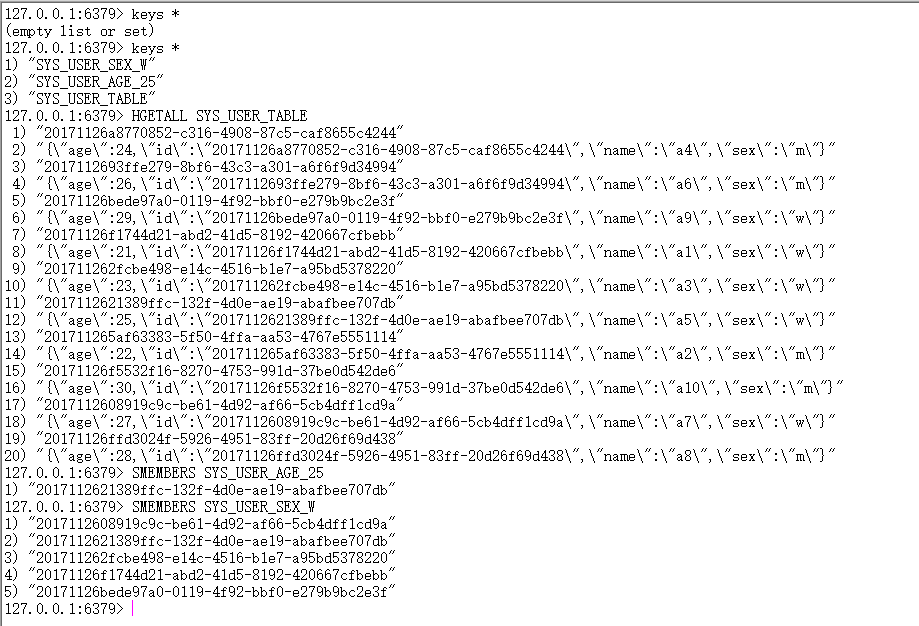

我们得到三张表，一张用户表，数据类型为Hash（简化起见，设置数据为Json）,一张女性索引表，类型为Set，存储性别为女的用户索引表，一张年龄为25的索引表，类型为Set，存储年龄为25的用户索引表

我们要向实现之前的SQL语句，只需要对两个索引表取并集，然后遍历索引去用户表里去查询用户即可：

```
@Test
public void query() {
    //取出所有女的User:SELECT USER WHERE SEX='w'
    Set<String> userSexW = jedis.smembers(SYS_USER_SEX_W);
    List<String> mList = new ArrayList<>(userSexW);
    mList.forEach(m -> System.out.println(jedis.hget(SYS_USER_TABLE, m)));

    System.out.println("=======================================");
    //SELECT USER WHERE SEX='w' AND AGE = '25'
    Set<String> filter = jedis.sinter(SYS_USER_SEX_W, SYS_USER_AGE_25);
    List<String> fliterList = new ArrayList<>(filter);
    fliterList.forEach(m -> System.out.println(jedis.hget(SYS_USER_TABLE, m)));
}
```

最终结果如下，操作成功：
```
{"age":23,"id":"201711262fcbe498-e14c-4516-b1e7-a95bd5378220","name":"a3","sex":"w"}
{"age":29,"id":"20171126bede97a0-0119-4f92-bbf0-e279b9bc2e3f","name":"a9","sex":"w"}
{"age":21,"id":"20171126f1744d21-abd2-41d5-8192-420667cfbebb","name":"a1","sex":"w"}
{"age":27,"id":"2017112608919c9c-be61-4d92-af66-5cb4dff1cd9a","name":"a7","sex":"w"}
{"age":25,"id":"2017112621389ffc-132f-4d0e-ae19-abafbee707db","name":"a5","sex":"w"}
=======================================
{"age":25,"id":"2017112621389ffc-132f-4d0e-ae19-abafbee707db","name":"a5","sex":"w"}
```

上面这种场景，在设计表之初就已经只要要查询的条件，这样才能根据条件生成索引表，若表已经存在，那么需要重新导入基表，生成索引，这种方式好处在于查询非常快速，缺点是不够灵活和占据空间比较大，总的来说是一种空间换时间的做法。